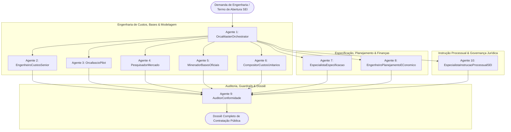

# OrcaAI - Inteligência Artificial para Orçamento de Obras Públicas
## MGI / SRA-ES - Superintendência Regional de Administração no Espírito Santo

---

## 📋 1. Visão Geral

O **OrcaAI** é uma plataforma modular de agentes inteligentes especializada em Engenharia de Custos, Orçamentação Pública e Instrução Processual de Obras e Serviços de Engenharia conforme a **Lei Federal nº 14.133/2021**, o **Decreto Federal nº 7.983/2013**, o **Acórdão TCU nº 2.622/2013** e a **IN SEGES/ME nº 65/2021**.

O sistema foi desenhado sob o paradigma de **Aprendizado por Demonstração (*Learning from Demonstration - LfD*)**: o engenheiro opera a plataforma [Orçafascio](https://app.orcafascio.com/), enquanto o OrcaAI aprende e assimila as escolhas técnicas, avançando subsequentemente para a **operação autônoma supervisionada**, com **zero alucinações de códigos e preços**.



---

## 🤖 2. Matriz dos 10 Agentes Especialistas do OrcaAI

| Agente | Identificador | Função Primária | Entregáveis Gerados |
| :--- | :--- | :--- | :--- |
| **Agente 1** | `OrcaMasterOrchestrator` | Gestão mestre da árvore de projetos, triagem de demandas e ciclo LfD. | Plano de execução, ata de decisões e relatório executivo. |
| **Agente 2** | `EngenheiroCustosSenior` | Estruturação da EAP, levantamento de quantitativos e método construtivo. | EAP detalhada e pré-planilha referencial de engenharia. |
| **Agente 3** | `OrcafascioPilot` | Captura de ações humanas (LfD) e navegação autônoma no Orçafascio Web. | Sincronização e exportação de orçamentos no Orçafascio. |
| **Agente 4** | `PesquisadorMercado` | Pesquisa de preços escalonada: **Vitória $\rightarrow$ RJ $\rightarrow$ SP $\rightarrow$ BH** (IN 65/2021). | Mapa de cotações, 3 propostas válidas e preço de referência. |
| **Agente 5** | `MineradorBasesOficiais` | Mineração e indexação em alta velocidade de tabelas oficiais (SINAPI, IOPES, etc.). | Banco indexado local, consulta em ms e atualização mensal. |
| **Agente 6** | `CompositorCustosUnitarios` | Criação analítica de CPUs Próprias com produtividade técnica e insumos oficiais. | Ficha analítica de CPU (`SRAES-CP-XXX`) com insumos SINAPI/IOPES. |
| **Agente 7** | `EspecialistaEspecificacao` | Descrição técnica padronizada (padrão SINAPI/EMOP), especificações e TRs. | Descrição padronizada para CPU, Caderno Técnico e Memorial. |
| **Agente 8** | `EngenheiroPlanejamentoEConomico` | Planilhas `.xlsx` dinâmicas, BDI (TCU 2.622/2013), PERT/CPM, Curva S e Curva ABC. | Arquivo `.xlsx` com EAP sequenciada, BDI justificado e Gantt responsivo. |
| **Agente 9** | `AuditorConformidade` | Validação de guardrails (G-01 a G-10), rastreabilidade e anti-alucinação. | Relatório de Conformidade Legal e Auditoria de Códigos. |
| **Agente 10** | `EspecialistaInstrucaoProcessualSEI` | Instrução processual SEI, respostas a Pareceres AGU/CGU, TJTR e notas legais. | Notas Técnicas de resposta à AGU, Despachos SEI e TJTRs. |
| **Agente 5S** | `Auditor5S_Organizacao` | Guardião da metodologia 5S, governança estrutural e higienização contínua. | Relatório de Conformidade 5S e auditoria de diretórios. |

---

## 📁 3. Estrutura do Diretório `OrcaAI/`

```text
OrcaAI/
├── README.md                                  # Este documento de visão geral
├── spec/                                      # Especificações Técnicas e Diretrizes Oficiais
│   ├── orca_ai_system_spec.md                 # Spec Geral do Sistema OrcaAI
│   ├── lfd_learning_protocol.md               # Protocolo de Aprendizado por Demonstração (LfD)
│   ├── market_research_protocol.md            # Estratégia de Pesquisa de Mercado Escalonada
│   └── guardrails_validation_spec.md          # Validadores G-01 a G-10
├── agents/                                    # Fichas Técnicas dos Agentes Especialistas
│   ├── AGENTE_01_OrcaMasterOrchestrator.md
│   ├── AGENTE_02_EngenheiroCustosSenior.md
│   ├── AGENTE_03_OrcafascioPilot.md
│   ├── AGENTE_04_PesquisadorMercado.md
│   ├── AGENTE_05_MineradorBasesOficiais.md
│   ├── AGENTE_06_CompositorCustosUnitarios.md
│   ├── AGENTE_07_EspecialistaEspecificacao.md
│   ├── AGENTE_08_EngenheiroPlanejamentoEConomico.md
│   ├── AGENTE_09_AuditorConformidade.md
│   ├── AGENTE_10_EspecialistaInstrucaoProcessualSEI.md
│   └── AGENTE_5S_AuditorOrganizacao.md
├── skills/                                    # Módulos Python Executáveis
│   ├── bdi_calculator.py                      # Calculadora de BDI (TCU 2.622/2013)
│   ├── cronograma_generator.py                # Gerador de Cronograma Físico-Financeiro
│   ├── excel_budget_generator.py              # Compilador de Planilhas Excel (.xlsx)
│   └── code_guardrail_validator.py            # Validador de Códigos e Guardrails
├── templates/                                 # Modelos Formais de Peças Técnicas
│   ├── modelo_especificacao_tecnica.md
│   ├── modelo_justificativa_bdi.md
│   ├── modelo_composicao_propria_cpu.md
│   └── modelo_pesquisa_mercado.md
├── workflows/                                 # Procedimentos Operacionais Padrão (POP)
│   ├── pipeline_aprendizado_orcafascio.md
│   └── pipeline_geracao_dossie_completo.md
└── projetos/                                  # 📁 Acervo de Projetos e Demandas Orçamentárias
    ├── Item 01 - teto_elevadores/             # Recuperação do teto da casa de máquinas
    ├── Item 02 - Limpeza_robotizada_AC/       # Limpeza robotizada de dutos e PMOC
    ├── Item 03 - Lavagem_envidracada/         # Lavagem técnica de pele de vidro/fachada
    ├── Item 04 - Junta_dilatacao/             # Tratamento e calafetação de juntas
    ├── Item 05 - Pintura_grade/               # Pintura e proteção anticorrosiva de gradis
    ├── Item 06 - insulfilm/                   # Aplicação de película de controle solar
    ├── Item 07 - Pintura_externa_MGIES/       # Pintura predial externa
    ├── Item 08 - impermeabilizacao_cisterna/  # Impermeabilização de reservatório inferior
    ├── Item 09 - limpeza_FV/                  # O&M e limpeza de módulos fotovoltaicos
    ├── Item 10 - MNT_gerador_subestacao/      # Manutenção de gerador e subestação abrigada
    ├── Item 11 - Impermeabilizacao_Marquise/  # Impermeabilização da marquise frontal
    ├── Item 12 - Reforma_Suporte_CAG/         # Reforma estrutural do suporte dos chillers
    ├── Projetos Básicos/                      # Plantas DWG/PDF e arquivos de engenharia
    └── _governanca_sei_agu_cgu/               # Acervo Processual, Pareceres AGU, CGU e TJTR
```
