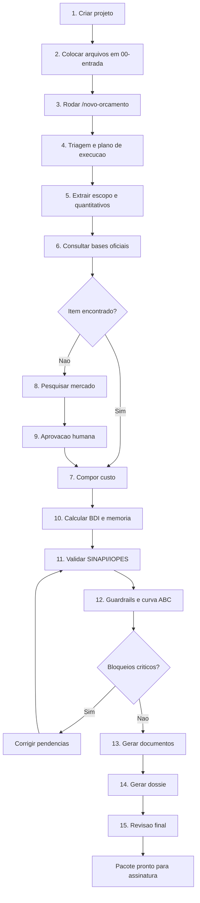

# Fluxograma de Operacao da Central Orca

Use este arquivo como roteiro pratico para operar os agentes no Antigravity.

## Fluxo Geral



## Roteiro de Uso

### 1. Criar projeto

```powershell
python scripts/criar_projeto_orca.py "2026-001-nome-do-servico"
```

### 2. Inserir arquivos

Coloque PDFs, DOCX, XLSX, imagens, plantas e propostas em:

```text
projetos/2026-001-nome-do-servico/00-entrada/
```

### 3. Iniciar agentes

No Antigravity, use:

```text
/novo-orcamento 2026-001-nome-do-servico
```

### 4. Consultar Orcafascio

Quando precisar consultar composicoes, use:

```text
/orcafascio consultar composicoes do projeto 2026-001-nome-do-servico
```

### 5. Pesquisar mercado

Quando nao houver base oficial adequada:

```text
/pesquisar-precos item sem referencia oficial
```

O fluxo deve parar para aprovacao humana antes de usar o preco.

### 6. Validar

```text
/validar-orcamento 2026-001-nome-do-servico
```

### 7. Gerar documentos

```text
/gerar-documentos 2026-001-nome-do-servico
```

### 8. Gerar dossie

```text
/gerar-dossie 2026-001-nome-do-servico
```

### 9. Revisao final

```text
/revisar-final 2026-001-nome-do-servico
```

## Pontos de Pausa Obrigatoria

- composicao propria;
- pesquisa de mercado;
- uso de base de outro estado;
- BDI excepcional;
- divergencia de unidade;
- pacote final para assinatura.

