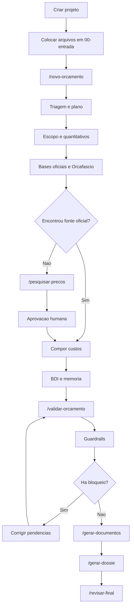

# Tutorial da Central Orca

Este tutorial explica como usar a pasta `Orca` como uma Central de Orcamento Publico Assistida por Agentes no Antigravity.

## 1. O que e a Central Orca

A Central Orca e uma estrutura de agentes, subagentes, skills, templates e comandos para apoiar a criacao de orcamentos publicos de obras e servicos de engenharia.

Ela foi criada para automatizar etapas que antes eram muito manuais:

- abrir uma nova demanda;
- organizar documentos de entrada;
- extrair escopo e quantitativos;
- pesquisar SINAPI, IOPES, SICRO e Orcafascio;
- montar composicoes de custo;
- aplicar BDI;
- validar codigos;
- gerar especificacao tecnica, memoria e relatorios;
- montar o dossie final.

## 2. Estrutura da Pasta

```text
Orca/
  .agent/
    agents/       Agentes principais
    subagents/    Subagentes operacionais
    skills/       Conhecimentos especializados
    workflows/    Comandos do Antigravity
    rules/        Regras globais
  bases/          Bases SINAPI, IOPES, SICRO e exportacoes Orcafascio
  projetos/       Projetos de orcamento
  templates/      Modelos de planilha, memoria, BDI e relatorios
  scripts/        Utilitarios locais
  output/         Relatorios consolidados
```

## 3. Agentes Principais

| Agente | Funcao |
| --- | --- |
| `central-orchestrator` | Coordena todo o fluxo. |
| `intake-triage-agent` | Recebe a demanda e identifica pendencias. |
| `project-planner` | Cria o plano de execucao. |
| `engenheiro-orcamentista-publico` | Faz a analise tecnica e de custos. |
| `orcamentista-mgi-es` | Aplica regras MGI/SRA-ES, Vitoria/ES e Orcafascio. |
| `compositor-custos` | Monta composicoes e planilha. |
| `pesquisador-bases-oficiais` | Procura referencias oficiais. |
| `pesquisador-mercado` | Faz cotacoes quando nao ha base oficial. |
| `validador-codigos` | Valida SINAPI/IOPES. |
| `guardrail-controladoria` | Revisa riscos, sobrepreco e conformidade. |
| `documentalista-tecnico` | Gera documentos tecnicos. |
| `revisor-final` | Confere tudo antes do dossie final. |

## 4. Comandos Principais

No Antigravity, use estes comandos:

```text
/novo-orcamento
/orcafascio
/pesquisar-precos
/validar-orcamento
/gerar-documentos
/gerar-dossie
/status-orca
/revisar-final
```

## 5. Preparacao Inicial

### 5.1 Abrir a pasta

Abra a pasta `Orca` como projeto no Antigravity.

### 5.2 Configurar Orcafascio

Copie o arquivo:

```text
.env.example
```

E configure as variaveis no seu ambiente:

```text
ORCAFASCIO_URL=https://app.orcafascio.com/
ORCAFASCIO_LOGIN=seu_login
ORCAFASCIO_PASSWORD=sua_senha
ORCA_DEFAULT_UF=ES
ORCA_DEFAULT_MUNICIPIO=Vitoria
ORCA_DEFAULT_BDI_SERVICO=25.00
```

Nao grave senha em arquivos compartilhados.

## 6. Criando um Novo Projeto

Dentro da pasta `Orca`, rode:

```powershell
python scripts\criar_projeto_orca.py "2026-001-limpeza-hvac"
```

Isso cria:

```text
projetos/2026-001-limpeza-hvac/
  00-entrada/
  01-escopo/
  02-quantitativos/
  03-orcamento/
  04-cotacoes/
  05-validacoes/
  06-documentos/
  07-assinados/
  projeto.md
  plano-execucao.md
  log-decisoes.md
```

## 7. Colocando os Arquivos de Entrada

Coloque os arquivos recebidos em:

```text
projetos/2026-001-limpeza-hvac/00-entrada/
```

Exemplos:

- PDFs;
- DOCX;
- XLSX;
- fotos;
- plantas;
- propostas;
- memorias;
- termos antigos;
- exportacoes do Orcafascio.

## 8. Fluxo Completo de Uso

### Passo 1 - Abrir a demanda

No Antigravity:

```text
/novo-orcamento 2026-001-limpeza-hvac
```

O sistema deve:

- ler os arquivos de entrada;
- preencher ou revisar `projeto.md`;
- listar pendencias;
- criar plano de execucao.

### Passo 2 - Extrair escopo e quantitativos

Peça ao agente:

```text
Analise os arquivos de entrada e gere o quadro de escopo e quantitativos.
```

Saidas esperadas:

```text
01-escopo/extracao-documentos.md
02-quantitativos/quadro-quantitativos.md
```

### Passo 3 - Consultar bases oficiais e Orcafascio

Use:

```text
/orcafascio consultar composicoes para o projeto 2026-001-limpeza-hvac
```

O agente deve:

- abrir o Orcafascio;
- consultar bases;
- buscar composicoes;
- exportar evidencias;
- registrar decisoes em `log-decisoes.md`.

### Passo 4 - Montar a planilha

Peça:

```text
Monte a planilha orcamentaria normalizada com base no escopo, quantitativos e fontes encontradas.
```

Saidas esperadas:

```text
03-orcamento/planilha-normalizada.csv
03-orcamento/memoria-calculo.md
03-orcamento/demonstrativo-bdi.md
```

### Passo 5 - Pesquisar mercado se necessario

Quando nao houver codigo ou composicao adequada:

```text
/pesquisar-precos item sem base oficial
```

Regra: o agente deve buscar 3 cotacoes e parar para sua aprovacao antes de usar o valor.

### Passo 6 - Validar o orcamento

Use:

```text
/validar-orcamento 2026-001-limpeza-hvac
```

Saidas esperadas:

```text
05-validacoes/validacao-codigos.md
05-validacoes/relatorio-guardrails.md
05-validacoes/curva-abc.md
```

### Passo 7 - Gerar documentos tecnicos

Use:

```text
/gerar-documentos 2026-001-limpeza-hvac
```

Saidas esperadas:

```text
06-documentos/especificacao-tecnica.md
06-documentos/memoria-calculo.md
06-documentos/relatorio-cotacoes.md
06-documentos/demonstrativo-bdi.md
```

### Passo 8 - Gerar o dossie

Use:

```text
/gerar-dossie 2026-001-limpeza-hvac
```

Saidas esperadas:

```text
indice-dossie.md
checklist-final.md
```

### Passo 9 - Revisao final

Use:

```text
/revisar-final 2026-001-limpeza-hvac
```

O agente deve responder se o pacote esta:

- aprovado;
- aprovado com ressalvas;
- bloqueado.

## 9. Fluxo Visual



## 10. Regras de Ouro

1. Nao inventar codigo.
2. Nao inventar preco.
3. Nao inventar coeficiente.
4. Nao usar pesquisa de mercado sem aprovacao.
5. Nao criar composicao propria sem registrar justificativa.
6. Sempre declarar data-base.
7. Sempre declarar BDI.
8. Sempre conferir unidade.
9. Sempre gerar relatorio de validacao.
10. Sempre revisar antes de assinar.

## 11. Exemplo de Prompt para Comecar

```text
Use a Central Orca para abrir o projeto 2026-001-limpeza-hvac.
Leia os arquivos em 00-entrada, classifique o servico, gere o plano de execucao,
extraia escopo e quantitativos, e aponte quais informacoes faltam antes de consultar o Orcafascio.
```

## 12. Exemplo de Prompt para Orcafascio

```text
No projeto 2026-001-limpeza-hvac, consulte no Orcafascio composicoes SINAPI-ES,
IOPES e bases relacionadas para os servicos listados em 02-quantitativos.
Registre codigos, descricoes, unidades, data-base e itens nao encontrados.
Nao crie composicao propria sem minha aprovacao.
```

## 13. Exemplo de Prompt para Validacao

```text
Valide a planilha em 03-orcamento contra as bases locais em bases/sinapi e bases/iopes.
Aponte codigos ausentes, unidades divergentes, itens sem fonte, BDI incorreto e itens A da curva ABC.
```

## 14. Problemas Comuns

| Problema | Solucao |
| --- | --- |
| Nao ha base SINAPI/IOPES local | Coloque a base em `bases/sinapi` ou `bases/iopes`; sem isso a validacao formal fica incompleta. |
| Orcafascio nao autentica | Confira variaveis de ambiente ou faca login manual. |
| Item nao existe em base oficial | Use `/pesquisar-precos` e registre aprovacao humana. |
| Unidade diverge | Revisar criterio de medicao antes de finalizar. |
| Documento contradiz planilha | Regerar documento a partir da planilha validada. |

## 15. Checklist Final

Antes de considerar um projeto pronto:

- [ ] `projeto.md` preenchido.
- [ ] `plano-execucao.md` atualizado.
- [ ] `log-decisoes.md` com aprovacoes.
- [ ] planilha normalizada gerada.
- [ ] memoria de calculo gerada.
- [ ] BDI demonstrado.
- [ ] codigos validados.
- [ ] curva ABC revisada.
- [ ] relatorio de guardrails sem bloqueios criticos.
- [ ] documentos tecnicos gerados.
- [ ] dossie final montado.
- [ ] revisao final concluida.

