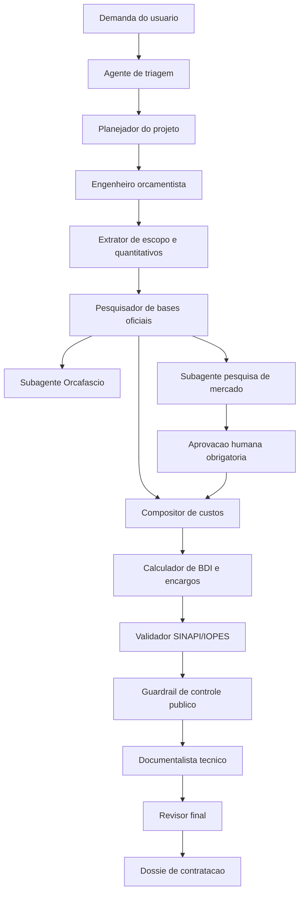

# Central de Orcamento Publico Assistida por Agentes

## 1. Proposta Executiva

A Central de Orcamento Publico Assistida por Agentes deve ser um ambiente de trabalho padronizado para receber demandas de engenharia, estruturar escopos, montar orcamentos, validar codigos SINAPI/IOPES, calcular BDI, gerar documentos tecnicos e organizar o dossie final de contratacao publica.

A base conceitual vem do projeto atual `Orcamento_de_Obra`, que ja possui exemplos reais de especificacoes tecnicas, planilhas, PDFs assinados e skills voltadas para MGI/SRA-ES, Vitoria/ES, SINAPI, IOPES, Orcafascio, pesquisa de mercado e guardrails de orcamento publico.

O objetivo da nova central e transformar esse trabalho em uma linha de producao assistida por agentes, com rastreabilidade, revisao tecnica e padrao documental.

## 2. Principios de Arquitetura

1. Toda demanda deve virar um projeto orcamentario com pasta propria.
2. Todo preco deve ter fonte rastreavel: SINAPI, IOPES, SICRO, Orcafascio, pesquisa de mercado ou composicao propria.
3. Composicoes proprias devem ter codigo interno controlado, justificativa e aprovacao humana.
4. Nenhum agente deve inventar codigo, preco, coeficiente ou fonte.
5. BDI, encargos, data-base, regime e municipio devem ficar explicitos.
6. Documentos finais devem ser gerados a partir dos mesmos dados usados na planilha.
7. A central deve manter logs de decisoes, pendencias, validacoes e aprovacoes.

## 3. Arquitetura Logica



## 4. Fluxo Operacional Padrao

### Fase 0 - Abertura da Demanda

Entrada esperada:

- descricao do servico;
- local de execucao;
- orgao/unidade demandante;
- arquivos de apoio: PDF, DWG, XLSX, DOCX, fotos, proposta, memoriais;
- prazo e finalidade: estimativa, termo de referencia, licitacao, aditivo, medicao ou parecer.

Saidas:

- ficha da demanda;
- classificacao do tipo de servico;
- lista de documentos recebidos;
- pendencias iniciais.

### Fase 1 - Planejamento do Orcamento

O agente planejador cria um plano curto com:

- escopo;
- entregaveis;
- agentes responsaveis;
- skills obrigatorias;
- bases de referencia previstas;
- riscos de cotacao ou composicao propria.

### Fase 2 - Leitura Tecnica e Quantitativos

O sistema extrai ou organiza:

- servicos principais;
- unidades de medida;
- quantitativos;
- criterios de medicao;
- premissas tecnicas;
- arquivos usados como evidencia.

### Fase 3 - Pesquisa de Bases Oficiais

Ordem recomendada:

1. SINAPI-ES.
2. IOPES/DER-ES.
3. SICRO, quando aplicavel.
4. SBC ou outras bases disponiveis no Orcafascio.
5. Bases regionais de fallback: SETOP, CPOS, EMOP, SCO.
6. Pesquisa de mercado, apenas quando a base oficial nao cobrir o item.

### Fase 4 - Composicao de Custos

Cada item da planilha deve ter:

- codigo;
- fonte;
- descricao;
- unidade;
- quantidade;
- custo unitario sem BDI;
- BDI aplicavel;
- preco unitario com BDI;
- memoria de calculo;
- observacoes e justificativas.

### Fase 5 - Pesquisa de Mercado

Usar apenas quando necessario. Regras:

- minimo de 3 cotacoes comparaveis;
- registro de data de acesso;
- nome da fonte;
- URL ou documento de proposta;
- criterio adotado: media, mediana ou menor preco;
- justificativa para descarte de valor inexequivel ou excessivo;
- aprovacao humana antes de usar em composicao propria.

### Fase 6 - Validacao e Guardrails

Validacoes obrigatorias:

- codigo SINAPI/IOPES existe na base local usada;
- descricao e unidade sao compativeis;
- BDI esta correto;
- nao ha item sem fonte;
- composicao propria tem codigo controlado;
- itens de fornecimento usam BDI diferenciado, quando aplicavel;
- data-base e regime estao declarados;
- curva ABC foi revisada;
- possivel sobrepreco foi verificado;
- documentos tecnicos e planilha contam a mesma historia.

### Fase 7 - Geracao de Documentos

Entregaveis padrao:

- planilha orcamentaria `.xlsx`;
- memoria de calculo;
- especificacao tecnica ou memorial descritivo;
- termo de justificativas tecnicas;
- relatorio de cotacoes, quando houver;
- demonstrativo de BDI;
- relatorio de validacao SINAPI/IOPES;
- PDF final para assinatura;
- indice do dossie.

## 5. Estrutura de Pastas Recomendada

```text
central-orcamento-publico/
  .agent/
    agents/
    skills/
    workflows/
    rules/
    scripts/
  bases/
    sinapi/
    iopes/
    sicro/
    orcafascio-export/
    outras-bases/
  templates/
    planilhas/
    especificacoes/
    memoriais/
    relatorios/
    bdi/
  projetos/
    2026-001-limpeza-hvac/
      00-entrada/
      01-escopo/
      02-quantitativos/
      03-orcamento/
      04-cotacoes/
      05-validacoes/
      06-documentos/
      07-assinados/
      projeto.md
      log-decisoes.md
  scripts/
    validar_codigos.py
    gerar_relatorio_orcamento.py
    exportar_dossie.py
  output/
    relatorios-consolidados/
```

## 6. Agentes Necessarios

### 6.1 Agentes Centrais

| Agente | Papel | Skills principais |
| --- | --- | --- |
| `central-orchestrator` | Coordena todo o fluxo, chama agentes e consolida decisoes. | `intelligent-routing`, `plan-writing`, `guardrails-orcamento-publico` |
| `intake-triage-agent` | Recebe demanda, classifica servico e identifica arquivos faltantes. | `brainstorming`, `engenheiro-civil-senior` |
| `project-planner` | Cria plano do projeto, etapas, agentes e entregaveis. | `plan-writing`, `brainstorming` |
| `engenheiro-orcamentista-publico` | Analisa escopo, criterios de medicao e metodologia de custos. | `engenheiro-civil-senior`, `vitoria-cost-engineering` |
| `orcamentista-mgi-es` | Especialista MGI/SRA-ES, Vitoria/ES, BDI e Orcafascio. | `orcafascio-mgi-automation`, `bdi-servicos-es` |
| `compositor-custos` | Monta CPUs, compoe insumos e aplica BDI. | `descritor-servicos-sinapi`, `orcafascio-integration` |
| `pesquisador-bases-oficiais` | Pesquisa SINAPI, IOPES, SICRO e bases do Orcafascio. | `vitoria-cost-engineering`, `orcafascio-integration` |
| `pesquisador-mercado` | Busca cotacoes quando nao ha base oficial adequada. | `pesquisa-mercado-vitoria`, `pesquisa-mercado-licitacoes` |
| `validador-codigos` | Valida codigos, unidades e descricoes SINAPI/IOPES. | `check-sinapi-iopes-codes` |
| `guardrail-controladoria` | Revisa conformidade, sobrepreco, rastreabilidade e riscos. | `guardrails-orcamento-publico` |
| `documentalista-tecnico` | Gera especificacoes, memoriais, pareceres e relatorios. | `documentos-tecnicos-hvac`, `documentos-tecnicos-fv`, `documentos-tecnicos-gerador` |
| `revisor-final` | Faz conferencia final entre planilha, memoria e documentos. | `engenheiro-civil-senior`, `guardrails-orcamento-publico` |

### 6.2 Subagentes Operacionais

| Subagente | Funcao |
| --- | --- |
| `browser-orcafascio-subagent` | Navega no Orcafascio, consulta composicoes e exporta dados. |
| `spreadsheet-normalizer-subagent` | Normaliza planilhas recebidas e exportadas. |
| `pdf-docx-extractor-subagent` | Extrai texto e tabelas de PDF/DOCX. |
| `quantity-takeoff-subagent` | Apoia levantamento de quantitativos a partir de plantas, memoriais e planilhas. |
| `quotation-harvester-subagent` | Coleta e organiza cotacoes de mercado. |
| `code-validator-subagent` | Executa validacao automatica de codigos SINAPI/IOPES. |
| `bdi-calculator-subagent` | Calcula e confere BDI por tipo de item. |
| `document-renderer-subagent` | Gera DOCX/PDF e confere formatacao. |
| `approval-notifier-subagent` | Pausa o fluxo e solicita validacao humana em pontos criticos. |

## 7. Skills Necessarias

### 7.1 Skills Ja Existentes no Projeto Atual

- `engenheiro-civil-senior`
- `vitoria-cost-engineering`
- `bdi-servicos-es`
- `orcafascio-integration`
- `orcafascio-mgi-automation`
- `descritor-servicos-sinapi`
- `guardrails-orcamento-publico`
- `pesquisa-mercado-vitoria`
- `pesquisa-mercado-licitacoes`
- `orcamento-limpeza-hvac-es`
- `orcamento-limpeza-fv-es`
- `orcamento-gerador-es`
- `documentos-tecnicos-hvac`
- `documentos-tecnicos-fv`
- `documentos-tecnicos-gerador`
- `check-sinapi-iopes-codes`
- `plan-writing`
- `brainstorming`
- `intelligent-routing`
- `documentation-templates`

### 7.2 Skills Novas Recomendadas

| Skill nova | Motivo |
| --- | --- |
| `extracao-quantitativos-engenharia` | Padronizar leitura de projetos, memoriais, DWG/PDF e planilhas de quantitativos. |
| `normalizacao-planilhas-orcamento` | Converter planilhas diferentes para um modelo unico da central. |
| `curva-abc-sobrepreco` | Fazer curva ABC, detectar itens materialmente relevantes e risco de sobrepreco. |
| `cronograma-fisico-financeiro` | Gerar cronogramas vinculados ao orcamento. |
| `matriz-riscos-contratacao` | Estruturar riscos de execucao, preco, medicao e contratacao. |
| `termo-referencia-obras-servicos` | Gerar TR, projeto basico e justificativas tecnicas conforme Lei 14.133/2021. |
| `medicao-e-aditivo-contratual` | Apoiar medicao, reequilibrio, reajuste e aditivos. |
| `dossie-licitacao-publica` | Montar indice, checklist e pacote final para instrucao processual. |
| `auditoria-fontes-precos` | Conferir se cada preco tem origem, data-base e evidencia adequada. |

## 8. Modelo de Dados Minimo

Cada item orcamentario deve seguir um modelo estruturado:

```yaml
item:
  numero: "1.2"
  codigo: "SINAPI-XXXXX"
  sistema: "SINAPI"
  descricao: "Servico..."
  unidade: "m2"
  quantidade: 100.0
  custo_unitario_sem_bdi: 10.00
  bdi_percentual: 25.00
  preco_unitario_com_bdi: 12.50
  fonte:
    nome: "SINAPI-ES"
    data_base: "2026-05"
    arquivo_referencia: "bases/sinapi/..."
  validacao:
    codigo_encontrado: true
    unidade_compativel: true
    descricao_compativel: true
  observacoes: ""
```

## 9. Pontos de Aprovacao Humana

A central deve parar e pedir aprovacao humana quando:

- nao encontrar item em base oficial;
- precisar usar pesquisa de mercado;
- criar composicao propria;
- usar base de outro estado;
- aplicar BDI diferente do padrao;
- houver divergencia entre descricao da planilha e base oficial;
- houver item relevante na curva ABC sem fonte robusta;
- o documento final estiver pronto para assinatura.

## 10. Roadmap de Implantacao

### Etapa 1 - MVP

- Criar estrutura de pastas.
- Migrar as skills existentes.
- Criar modelo unico de planilha.
- Criar fluxo para: demanda -> orcamento -> validacao -> documento final.
- Usar os itens 01 a 11 como casos de teste.

### Etapa 2 - Automacao

- Integrar script de validacao SINAPI/IOPES.
- Criar normalizador de planilhas.
- Criar gerador de relatorio de validacao.
- Automatizar geracao de DOCX/PDF.

### Etapa 3 - Orcafascio e Bases

- Padronizar exportacoes do Orcafascio.
- Criar catalogo local de bases.
- Implementar historico de data-base.
- Criar comparador entre bases e planilhas.

### Etapa 4 - Governanca

- Criar trilha de auditoria.
- Criar checklist de conformidade.
- Criar matriz de risco.
- Criar painel de status dos orcamentos.

## 11. Resultado Esperado

Ao final, a central deve permitir que uma nova demanda de obra ou servico de engenharia seja processada com:

- menor retrabalho;
- padrao documental uniforme;
- composicoes rastreaveis;
- validacao tecnica automatizada;
- controle de riscos de sobrepreco;
- memoria de calculo auditavel;
- documentos finais prontos para assinatura e instrucao processual.

