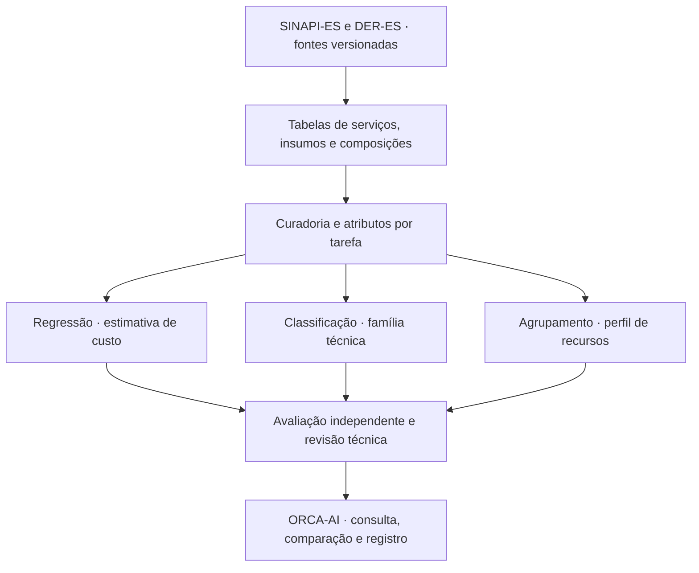

# Viabilidade de Machine Learning com dados estruturados no ORCA-AI

**Disciplina:** aprendizado de máquina aplicado a dados estruturados — UFG.  
**Data:** 27/09/2026. **Finalidade:** apoiar a decisão sobre o trabalho, antes da proposta definitiva e da implementação.

> **Estudo preliminar preservado.** Após a leitura das aulas e a inspeção das planilhas SINAPI, a [proposta atual](../spec/ml_ufg/proposta_projeto_ml_es.md) passou a orientar o trabalho: Regressão Linear simples/múltipla, Random Forest com comparadores árvore/KNN e K-Means. As alternativas de modelos abaixo registram a análise anterior. O usuário confirmou as três tarefas; reforço fica para uma evolução futura. A composição analítica do SINAPI foi encontrada, conforme a [nota de evidências](../spec/ml_ufg/evidencias_dados_sinapi_es.md).

## 1. Parecer executivo

**É viável investigar as três tarefas no ORCA-AI: regressão, classificação supervisionada e agrupamento.** A viabilidade metodológica está sustentada pelos tipos de dados encontrados. A suficiência da amostra e a qualidade dos modelos ainda precisam ser medidas após a preparação das tabelas.

O usuário confirmou **SINAPI-ES e DER-ES/IOPES** como fontes do recorte. Recomendamos um módulo de **análise de composições e custos referenciais do Espírito Santo**, com três funções complementares:

| Tarefa | Problema que pode resolver | Candidato inicial | Condição para executar |
| --- | --- | --- | --- |
| Regressão | Estimar a evolução do custo referencial de serviços entre competências; alternativamente, estimar o custo de um serviço pelas suas características técnicas | Ridge; comparação com HistGradientBoostingRegressor | Histórico comparável, no primeiro caso; atributos técnicos independentes do preço, no segundo |
| Classificação | Sugerir a família técnica de uma composição própria ou importada a partir dos recursos que a compõem | RandomForestClassifier, comparado com regressão logística | Composições estruturadas e famílias revisadas, com exemplos independentes suficientes |
| Agrupamento | Encontrar perfis de composição semelhantes no consumo e na distribuição dos recursos | KMeans; comparação com agrupamento aglomerativo se necessário | Composições analíticas completas e atributos comparáveis |

O conjunto de dados pode ser comum, mas **cada tarefa terá suas próprias entradas, saída e avaliação**. Uma variável válida para agrupamento pode revelar indevidamente a resposta da regressão.

O núcleo recomendado usa Python e scikit-learn. O LLM já utilizado pelo orquestrador pode coordenar consultas e apresentar resultados. A demonstração acadêmica dessas três tarefas não depende da escolha de um novo LLM, de treinamento generativo ou de um banco vetorial.

## 2. Equipe e escopo da análise

A consulta foi dividida em três pareceres de subagentes: `viabilidade_regressao`, `viabilidade_classificacao` e `pesquisador_ml_bases`, este último responsável por agrupamento e qualidade da avaliação. A coordenação confrontou os pareceres com a auditoria das fontes e as fichas dos agentes existentes.

Foram aplicadas as skills de análise estatística, exploração de dados, validação de dados e engenharia civil disponíveis nesta sessão. As cinco skills externas selecionadas anteriormente continuam como opções de adoção; este estudo não as instalou.

Na organização do ORCA-AI, A2/A6 revisam significado técnico das composições; A5 acompanha fontes e edições; A7 apoia os rótulos; A11 coordena o experimento; A9/SA-ML-05 avaliam os resultados. A3 poderá consumir as recomendações no fluxo do Orçafascio. A participação dos demais agentes segue as [responsabilidades já documentadas](../spec/ml_ufg/agentes_e_subagentes.md).

O foco desta análise é o ORCA-AI. A comparação com Vault AI ficará para um estudo que disponha de sua descrição, dados e problema de negócio; ainda não há evidência para escolher entre os dois projetos.

## 3. Fontes e significado de “dados estruturados”

### Base inicial comprovada

O DER-ES Edificações é o ponto de partida com acesso mais bem demonstrado: a auditoria anterior abriu amostras de serviços, insumos e composições em XLSX/PDF da competência maio/2026. O portal também lista edições mensais de 2023, 2024, 2025 e janeiro a maio/2026. Essa listagem torna plausível estudar histórico; a continuidade dos arquivos e dos serviços ainda não foi homologada. [Fonte oficial DER-ES](https://der.es.gov.br/referencial-de-precos-edificacoes).

A referência oral a “CIDAP” foi esclarecida pelo usuário: trata-se do **SINAPI-ES**, a ser estudado junto com DER-ES/IOPES. O usuário definiu que o trabalho começa pelo SINAPI-ES, com bases e experimentos separados; os resultados serão comparados posteriormente. O ZIP Excel de agosto/2026 foi baixado pelo navegador e preservado compactado, conforme o [manifesto de download](../bases/sinapi/2026-08/originais/manifesto_download.json). A inspeção das planilhas e a seleção do ES são a próxima etapa.

As bases mantêm identificadores, grupos e metodologias próprios. A união dos registros exige correspondências revisadas; códigos iguais e descrições parecidas não comprovam equivalência. Avaliar primeiro cada fonte e depois a transferência entre elas evita atribuir ao modelo diferenças que vêm apenas do formato do catálogo.

IOPES é a denominação histórica indicada pelo usuário para a referência hoje consultada no DER-ES. Não contar o mesmo arquivo rotulado IOPES e DER-ES como duas amostras independentes.

### O que precisa ser preparado

Uma planilha de relatório contém cabeçalhos, subtotais, grupos e blocos repetidos. É preciso transformá-la em tabelas de entidades; sua quantidade de linhas não equivale à quantidade de exemplos para ML.

| Tabela derivada | Conteúdo mínimo |
| --- | --- |
| Edições | Fonte, UF, competência, revisão, regime, publicação observada, captura, URL e hash |
| Serviços | Identificador, descrição oficial, unidade, grupo nativo e custo de referência |
| Insumos | Identificador, descrição, categoria, unidade e preço |
| Composições | Relação serviço–recurso, coeficiente, unidade e referência à edição |
| Exemplos e atributos | Variáveis disponíveis no momento do uso, rótulos revisados quando necessários e grupo de duplicatas |

O núcleo acadêmico usará **colunas numéricas e categóricas**: unidades, contagens de recursos, categorias de insumos, coeficientes comparáveis e histórico de preços. Descrições oficiais ficam disponíveis para rastreabilidade e revisão.

A sugestão anterior de classificar a demanda por texto continua possível como extensão. Neste estudo, ela cede prioridade à classificação de composições estruturadas, para aderir diretamente ao enunciado recebido. Converter texto em embeddings não será a única evidência de trabalho com dados estruturados.

## 4. Regressão: duas alternativas reais

### A. Prever o custo de uma competência futura — preferência para investigação

**Pergunta:** quanto poderá custar, no próximo período de referência, um serviço cujo histórico já conhecemos?

- **Observação:** serviço × competência, mantendo identidade técnica, unidade e regime comparáveis.
- **Saída:** custo unitário referencial da próxima competência ou sua variação em relação à anterior.
- **Entradas:** preços e variações de períodos anteriores, intervalos de tempo e demais informações já publicadas no instante da previsão.
- **Referência simples obrigatória:** manter o último custo publicado. Se os preços mudarem pouco, essa referência pode ser difícil de superar.
- **Modelos candidatos:** Ridge com atributos defasados; HistGradientBoostingRegressor como comparação não linear, se o volume preparado permitir.
- **Utilidade:** apoiar cenários de planejamento e indicar serviços cuja evolução merece acompanhamento. O resultado continua sendo uma estimativa; o orçamento utiliza a referência oficial aplicável e verificada.

**Condição:** extrair e conferir o histórico, incluindo alterações de código, unidade, escopo, regime e notas de revisão. A competência de uma tabela pode anteceder em meses sua publicação. O experimento deve simular o que estava disponível em cada data, sem incorporar retroativamente retificações futuras.

**Avaliação:** reservar blocos futuros de competências e avançar a data de corte; manter todos os serviços de uma competência no mesmo bloco. O mesmo serviço pode aparecer no passado e no futuro, porque aqui queremos prever sua evolução. Aplicar `TimeSeriesSplit` diretamente às linhas empilhadas de vários serviços pode dividir um mesmo mês e produzir uma avaliação incorreta.

Fontes metodológicas: [Ridge](https://scikit-learn.org/stable/modules/generated/sklearn.linear_model.Ridge.html), [HistGradientBoostingRegressor](https://scikit-learn.org/stable/modules/generated/sklearn.ensemble.HistGradientBoostingRegressor.html), [atributos defasados e avaliação temporal](https://scikit-learn.org/stable/auto_examples/applications/plot_time_series_lagged_features.html), [limites de TimeSeriesSplit](https://scikit-learn.org/stable/modules/generated/sklearn.model_selection.TimeSeriesSplit.html).

### B. Estimar o custo contemporâneo — alternativa com menor dependência de histórico

**Pergunta:** dadas características técnicas conhecidas de um serviço, qual é a estimativa de seu custo referencial na edição estudada?

As entradas seriam material, processo executivo, acabamento, espessura, dimensões e outras características pertinentes a uma família homogênea. Vários desses atributos estão no texto e exigem extração e revisão para se tornarem colunas. Código, unidade e preço isolados não asseguram um modelo útil.

Essa alternativa foi favorecida no parecer de regressão por depender de menos edições. A consolidação recomenda investigar primeiro a disponibilidade do histórico: a opção temporal tem utilidade mais direta para planejamento, enquanto a contemporânea exige atributos técnicos que ainda não foram preparados. **A escolha entre A e B permanece aberta.**

Para B, comparar os mesmos regressores com a mediana do treino, usando [DummyRegressor](https://scikit-learn.org/stable/modules/generated/sklearn.dummy.DummyRegressor.html). Separar serviços equivalentes e variantes próximas em grupos de treino/teste. Se a composição exata já estiver identificada, seu preço oficial pode ser consultado diretamente.

### Métricas e limites comuns

Usar MAE e RMSE por família e unidade; apresentar também quantidade de serviços e períodos avaliados. Não somar erros em R$/m², R$/m e R$/un numa única MAE. Mesmo a unidade igual não garante escopo comparável. Os períodos e faixas de erro precisam ser mostrados, especialmente quando poucos meses independentes estiverem disponíveis.

Não prever o total a partir dos mesmos custos parciais cuja soma já o determina. Não prometer custos reais de execução, preço vencedor de licitação ou custo final da obra usando apenas tabelas referenciais. Nenhum intervalo de previsão será apresentado como calibrado antes de avaliar sua cobertura.

## 5. Classificação supervisionada

**Pergunta:** a qual família técnica pertence uma composição própria ou importada, considerando seus recursos?

- **Observação:** uma composição de serviço, com edição e regime identificados.
- **Entradas:** unidade; contagens de insumos por categoria; presença de materiais, mão de obra e equipamentos; horas por unidade quando disponíveis e comparáveis; famílias de materiais e ocupações definidas independentemente do rótulo.
- **Saída:** família técnica revisada, como pintura, impermeabilização ou instalações elétricas. São exemplos de classes; a lista definitiva depende dos dados.
- **Utilidade:** organizar composições, sugerir classificação e apresentar divergências para revisão técnica.
- **Modelos:** DummyClassifier como referência; regressão logística como comparação simples; RandomForestClassifier como candidato não linear.

Os grupos oficiais ajudam a propor os rótulos, que devem ser revisados. Código do serviço, seus prefixos, grupo/subgrupo e posição no relatório ficam fora das entradas. Também não se define uma classe por uma regra aritmética sobre as mesmas variáveis para depois apresentar o aprendizado dessa regra como descoberta.

**Limite operacional:** esta função pressupõe que a composição esteja disponível. Uma demanda como “impermeabilizar uma cisterna” não contém, por si só, coeficientes e recursos. Usar a composição escolhida ao final para prever a escolha inicial seria vazamento de informação.

**Avaliação:** separar composições equivalentes por grupos; verificar quantos grupos independentes existem em cada classe antes de escolher as partições. Usar macro-F1, precisão/recall por classe, matriz de confusão e contagens. Quando os dados dos projetos forem adequados, reservar projetos inteiros para uma avaliação de uso real. As 12 pastas existentes não garantem quantidade suficiente de exemplos.

Atributos estruturais podem não distinguir famílias de serviços parecidas. Se isso ocorrer, restringir o recorte ou registrar a limitação. A escolha final entre floresta e regressão logística depende dos resultados, sem taxa de acerto prometida.

Fontes: [RandomForestClassifier](https://scikit-learn.org/stable/modules/generated/sklearn.ensemble.RandomForestClassifier.html), [LogisticRegression](https://scikit-learn.org/stable/modules/generated/sklearn.linear_model.LogisticRegression.html), [DummyClassifier](https://scikit-learn.org/stable/modules/generated/sklearn.dummy.DummyClassifier.html), [StratifiedGroupKFold](https://scikit-learn.org/stable/modules/generated/sklearn.model_selection.StratifiedGroupKFold.html).

## 6. Agrupamento sem rótulos

**Pergunta:** quais composições apresentam perfis semelhantes na distribuição dos seus recursos?

- **Observação:** uma composição analítica; o primeiro estudo pode fixar edição e regime.
- **Entradas:** participações de mão de obra, materiais, equipamentos e outros no custo direto; número de insumos distintos e diversidade por categoria. Preço absoluto fica fora do primeiro agrupamento.
- **Saída:** grupo exploratório e perfil dos recursos. Nomes como “intensivo em mão de obra” só serão atribuídos após examinar os grupos encontrados.
- **Utilidade:** navegar pelo catálogo e selecionar composições representativas ou incomuns para revisão.
- **Modelo inicial:** KMeans; agrupamento aglomerativo como comparação se a geometria dos grupos justificar.

As participações são adimensionais e permitem comparar perfis sem tratar diretamente R$/m e R$/m² como a mesma medida. Ainda assim, unidade e escopo técnico precisam ser examinados. Contagens e participações têm escalas diferentes: transformação, pesos e padronização devem ser registrados para evitar que uma coluna domine a distância sem justificativa.

Antes de calcular os atributos, resolver subcomposições sem dupla contagem e conferir custos ausentes, total zero, categorias desconhecidas e BDI. A falta de uma parcela por erro de extração não pode virar participação zero.

**Avaliação:** silhouette, tamanhos dos grupos, estabilidade entre sementes e reamostragens e revisão técnica de casos típicos e limítrofes. Não fixar previamente que haverá exatamente três grupos. Comparar uma pequena faixa de quantidades de grupos e documentar o critério de escolha. Repetições mensais da mesma composição não devem dominar a formação dos grupos.

Um cluster não demonstra equivalência técnica, irregularidade ou sobrepreço. Ele descreve semelhança segundo os atributos escolhidos. Se não surgirem grupos estáveis e úteis, essa conclusão também deve constar do trabalho.

Fontes: [agrupamento no scikit-learn](https://scikit-learn.org/stable/modules/clustering.html), [silhouette](https://scikit-learn.org/stable/modules/generated/sklearn.metrics.silhouette_score.html), [pré-processamento](https://scikit-learn.org/stable/modules/preprocessing.html), [ARI para comparar atribuições](https://scikit-learn.org/stable/modules/generated/sklearn.metrics.adjusted_rand_score.html).

## 7. Modelos, integração e esforço

Proposta de ferramentas: pandas/openpyxl para preparação tabular; scikit-learn para modelos, transformações e métricas; notebooks e tabelas de resultados para a entrega acadêmica. `Pipeline` e `ColumnTransformer` permitem preparar colunas numéricas e categóricas dentro de cada divisão de treinamento. [Exemplo oficial](https://scikit-learn.org/stable/auto_examples/compose/plot_column_transformer_mixed_types.html), [prevenção de vazamento](https://scikit-learn.org/stable/common_pitfalls.html).

O planejamento inicial considera execução local em CPU e amostras controladas. Tempo, memória e necessidade de ampliar recursos serão medidos depois de contar os registros e preparar os atributos; não há estimativa de desempenho computacional validada.

O maior esforço esperado está na preparação dos dados: converter relatórios em tabelas, relacionar serviços e insumos, conferir unidades e revisar rótulos. A coleta histórica aumenta o esforço da regressão temporal. Um painel pode apresentar as três saídas, cada uma com fonte, versão e limites próprios. A integração automática com Orçafascio permanece uma etapa posterior à demonstração dos modelos.

## 8. Verificações para transformar viabilidade em experimento

1. Conferir e extrair o recorte ES do ZIP SINAPI já obtido; registrar separadamente as edições SINAPI-ES e DER-ES/IOPES.
2. Escolher uma edição DER-ES e conferir extração, campos, duplicatas e relação entre serviços e insumos.
3. Contar composições válidas e grupos independentes por família; registrar ausências e classes ambíguas.
4. Para regressão temporal, conferir um painel histórico de serviços estáveis, suas datas de disponibilidade e períodos reserváveis para teste. Para a alternativa contemporânea, conferir atributos técnicos disponíveis antes de conhecer o preço.
5. Definir entradas, alvo e partições separadamente para cada tarefa. Ajustar transformações somente nos dados de treino quando houver teste reservado.
6. Comparar modelos com referências simples e registrar previsões, erros e limitações. A atividade acadêmica continua válida se um modelo não superar a referência; o resultado deve ser explicado com evidências.

Os arquivos originais e os 12 projetos permanecem em seus caminhos. Datasets e experimentos futuros serão derivados versionados, conforme a [especificação de preservação e avaliação](../spec/ml_ufg/dados_e_avaliacao.md). O uso da última tabela para um orçamento segue o [protocolo de atualização](../spec/ml_ufg/bases_servicos_e_atualizacao.md); o estudo temporal também necessita das edições anteriores.

## 9. Decisões recomendadas ao usuário

**Encaminhamento atualizado:** manter o ORCA-AI como candidato ao trabalho e investigar as três tarefas num módulo tabular. Por decisão do usuário, iniciar pelo SINAPI-ES, estudar DER-ES/IOPES separadamente e comparar os resultados depois. A evidência atual justifica preparar e perfilar os dados, sem antecipar resultados de modelos.

As decisões que mais mudam o projeto são:

- **Sequência das fontes — confirmada pelo usuário:** SINAPI-ES primeiro; DER-ES/IOPES em estudo separado; comparação posterior dos resultados. O ZIP SINAPI foi obtido e aguarda extração.
- **Regressão:** preferência por previsão entre competências se o histórico for aproveitável; alternativa de estimativa contemporânea se houver características técnicas suficientes.
- **Escopo:** começar com famílias tecnicamente comparáveis e classes sustentadas pela amostra; a quantidade será definida pela inspeção, não por uma meta arbitrária.

**Entrega acadêmica possível:** um conjunto tabular documentado; três experimentos reproduzíveis; comparação com referências simples; métricas e análise dos erros; demonstração das funções no contexto do ORCA-AI. O regulamento completo, o prazo e eventuais restrições de ferramentas da disciplina ainda não foram fornecidos.

Este relatório registra viabilidade e opções de desenho. Nenhum modelo foi treinado e nenhuma qualidade preditiva foi medida nesta etapa.
