# Aprendizado de máquina aplicado ao ORCA-AI

Relatório de consolidação | Universidade Federal de Goiás (UFG)

Disciplina: Aprendizado de máquina aplicado a dados estruturados. Professor: Ronaldo. Autor: engenheiro Luis Fernando. Universidade Federal de Goiás (UFG). Vitória, Espírito Santo. Resultados executados em 27/09/2026; edição para entrega em 28/09/2026.

Tema: previsão de custos, classificação de famílias técnicas e descoberta de perfis de recursos em pintura e acabamentos. Fontes: SINAPI-ES e DER-ES/IOPES, analisadas separadamente. Regime: sem desoneração. Catálogo de referência: maio/2026.

Resumo executivo

SINAPI-ES: 514 serviços no catálogo. O recorte abrange pintura, pisos e revestimentos/forros. A regressão superou o último preço em 0 de 3 nichos. Árvore de decisão obteve F1 macro 0,791 em 102 serviços de teste; K-Means selecionou 3 grupos.

DER-ES / IOPES: 70 serviços no catálogo. O recorte abrange pintura, pisos e revestimentos/forros. A regressão superou o último preço em 0 de 3 nichos. Árvore de decisão obteve F1 macro 0,562 em 14 serviços de teste; nenhum k atendeu aos critérios; o agrupamento é somente diagnóstico.

As três tarefas respondem a perguntas diferentes. Seus indicadores não formam uma nota única nem um ranking entre as tabelas oficiais. O experimento apoia conferência e estudo acadêmico; a equivalência técnica dos serviços continua dependente de revisão de engenharia.

| Tarefa | Pergunta | Saída |
| --- | --- | --- |
| Regressão | Qual o custo da próxima competência? | Valor em R$/m² e erro |
| Classificação | A qual nicho pertence a composição? | Classe sugerida e matriz de erros |
| Agrupamento | Quais serviços têm perfis de recursos semelhantes? | Grupos exploratórios e seus perfis |

[Abrir o desenvolvimento no GitHub - versão avaliada](https://github.com/luferdias/ORCA-AI/tree/e20741b0214dff489147fa04739bb2a1ed44bc07/OrcaAI/ml)

# Guia de leitura e acesso ao desenvolvimento

Este PDF reúne as três tarefas solicitadas: previsão por regressão, classificação supervisionada e agrupamento não supervisionado. Os títulos azuis de links são clicáveis e abrem o código ou a evidência correspondente no GitHub.

Roteiro de leitura: dados e método (seções 1 e 2); regressão e exemplo de pintura (3 e 4); classificação e matrizes de confusão (5 e 6); agrupamento e perfis (7 e 8); discussão conjunta (9); reprodução e referências (10). Os apêndices organizam os arquivos de cada fonte.

Versão experimental fixada: commit e20741b0214dff489147fa04739bb2a1ed44bc07. Os links preservam essa versão do código e dos resultados, mesmo que a branch main receba melhorias. Esta edição acrescenta navegação e identificação acadêmica; as métricas vêm da execução já concluída.

Acesso público: em 28/09/2026, o proprietário autorizou tornar o repositório público para consulta. Os links permitem ler e baixar os arquivos sem convite ou login. A escrita no repositório permanece restrita às contas autorizadas. O PDF contém os resultados e gráficos para leitura independente.

Para começar pelo código, abra executar_estudo.py. Esse arquivo executa as três tarefas no mesmo recorte temático. Os scripts individuais e os módulos especializados estão ligados nas seções de resultados. CSV é uma tabela de dados que pode ser baixada e aberta no Excel, no VS Code ou em Python.

[1. Código principal - executar_estudo.py](https://github.com/luferdias/ORCA-AI/blob/e20741b0214dff489147fa04739bb2a1ed44bc07/OrcaAI/ml/executar_estudo.py)

[2. Guia de instalação e execução no VS Code](https://github.com/luferdias/ORCA-AI/blob/e20741b0214dff489147fa04739bb2a1ed44bc07/OrcaAI/ml/README.md)

[3. Resultados completos das duas fontes](https://github.com/luferdias/ORCA-AI/tree/e20741b0214dff489147fa04739bb2a1ed44bc07/OrcaAI/ml/outputs/entrega_ufg_acabamentos_2026-09-27)

[4. Manifesto da execução: parâmetros, versões e hashes](https://github.com/luferdias/ORCA-AI/blob/e20741b0214dff489147fa04739bb2a1ed44bc07/OrcaAI/ml/outputs/entrega_ufg_acabamentos_2026-09-27/execucao_estudo.json)

[5. Plano do experimento e critérios de avaliação](https://github.com/luferdias/ORCA-AI/blob/e20741b0214dff489147fa04739bb2a1ed44bc07/OrcaAI/spec/ml_ufg/plano_consolidacao_acabamentos.md)

# 1. Dados, recorte e unidades de observação

Foram usados os mesmos três nichos e apenas serviços em m². Classificação e agrupamento utilizam uma composição por serviço em maio/2026. A regressão usa o histórico e avalia pares serviço-competência entre março e maio/2026; portanto, sua quantidade de previsões é maior que a quantidade de serviços.

A interseção abaixo torna explícitos os serviços presentes em ambas as análises. Não foram removidos retrospectivamente serviços que deixaram de existir no catálogo de maio. A distribuição reflete os catálogos, não a frequência desses serviços em obras.

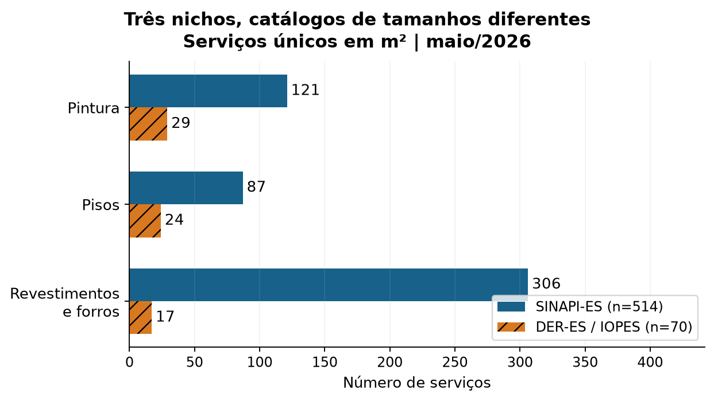

| Fonte | Catálogo | Variantes | Em ambas | Só catálogo | Só regressão |
| --- | --- | --- | --- | --- | --- |
| SINAPI-ES | 514 | 110 | 514 | 0 | 4 |
| DER-ES / IOPES | 70 | 52 | 60 | 10 | 0 |

[SINAPI-ES - dataset do recorte, 514 serviços](https://github.com/luferdias/ORCA-AI/blob/e20741b0214dff489147fa04739bb2a1ed44bc07/OrcaAI/ml/outputs/entrega_ufg_acabamentos_2026-09-27/sinapi_es/dados/dataset_acabamentos.csv)

[DER-ES/IOPES - dataset do recorte, 70 serviços](https://github.com/luferdias/ORCA-AI/blob/e20741b0214dff489147fa04739bb2a1ed44bc07/OrcaAI/ml/outputs/entrega_ufg_acabamentos_2026-09-27/der_es/dados/dataset_acabamentos.csv)

[Código de preparação dos atributos e dos grupos de variantes](https://github.com/luferdias/ORCA-AI/blob/e20741b0214dff489147fa04739bb2a1ed44bc07/OrcaAI/ml/orca_ml/atributos_acabamentos.py)

# 2. Método e controles do experimento

As classes pintura, pisos e revestimentos/forros derivam do mapeamento dos grupos oficiais. Não representam rótulos homologados por revisão humana. Os serviços foram unidos em grupos de variantes quando têm os mesmos recursos-folha ou descrições normalizadas semelhantes; esse procedimento reduz vazamento, mas não garante independência técnica completa.

Regressão: LinearRegression simples (último custo) e múltipla (três custos consecutivos); seleção por erro quadrático na validação e comparação com a persistência, que repete o último preço. Teste cronológico de março a maio/2026. Cada previsão olha apenas uma competência à frente, incorporando preços anteriores disponíveis. O estudo é retrospectivo, com histórico revisado.

A validação nominal da regressão é janeiro-fevereiro/2026. No SINAPI, o controle de publicação deixa apenas janeiro efetivamente avaliável: as revisões de janeiro e fevereiro foram publicadas em 25/03/2026, quando o alvo de fevereiro já era conhecido. No DER, janeiro e fevereiro são usados; faltam datas reais de publicação e a interpretação é retrospectiva.

Classificação: Random Forest, árvore de decisão e KNN. O primeiro dos cinco folds estratificados por grupos forma o teste; três folds internos escolhem parâmetros por F1 macro. A referência é prever a classe mais frequente. Escalonamento e modelos são ajustados dentro de cada treino. Código, descrição e grupo oficial do serviço ficam fora das dez entradas [3, 4].

Agrupamento: K-Means com escala própria por fonte, 30 inicializações, semente 42 e k entre 2 e 5. Seleção pela maior silhouette entre candidatos cujo menor grupo tem ao menos max(3, teto de 5% do catálogo). Classes não entram no ajuste. A estabilidade é reavaliada com outras sementes e subamostras de 80% [5].

Extração: subcomposições são expandidas até recursos-folha. No SINAPI, o total hierárquico concilia exatamente após truncar cada parcela a centavos em cada nível. As participações de recursos usam a soma sem truncamento e são aproximações. Preços SP usados na ausência de ES ficam identificados. O DER incorpora encargos à mão de obra; o SINAPI discrimina diversos encargos complementares, impedindo comparar suas contagens como se fossem equivalentes.

| Entradas de classificação e agrupamento | Unidade |
| --- | --- |
| 4 participações de custo: mão de obra, material, equipamento, outros | Fração de 0 a 1 |
| 4 contagens de recursos distintos nas mesmas categorias | Recursos por composição |
| Horas de mão de obra e equipamento extraídas das folhas em H | h/m² |

| Indicador | Leitura didática |
| --- | --- |
| MAPE | Média do erro absoluto em %, menor é melhor. |
| F1 macro | Equilibra precisão e recall, dando o mesmo peso às três classes. |
| Silhouette | Coesão e separação dos grupos, de -1 a 1; maior favorece separação. |
| ARI de estabilidade | Concordância entre agrupamentos após reajuste; 1 indica igualdade. |

# 3. Regressão: previsões comparadas ao último preço

O gráfico compara o erro médio percentual da regressão selecionada na validação com a previsão simples do último preço. n conta previsões serviço-competência. Cada observação tem o mesmo peso; estes números não medem economia financeira de uma obra.

Recortes nativos sem amostra suficiente permanecem explicitamente fora da regressão; o resultado parcial do DER não foi preenchido com estimativas inventadas. A cobertura por serviço está na tabela de populações e os motivos constam em regressao/resumo.json.

Erros pequenos podem coexistir com desempenho inferior ao último preço. A mediana descreve o erro típico e reduz a influência de casos extremos. MAE, RMSE e MSE por grupo nativo estão preservados nos arquivos técnicos. O limite de 5% usado em análises auxiliares é didático, sem caráter de tolerância oficial [4].

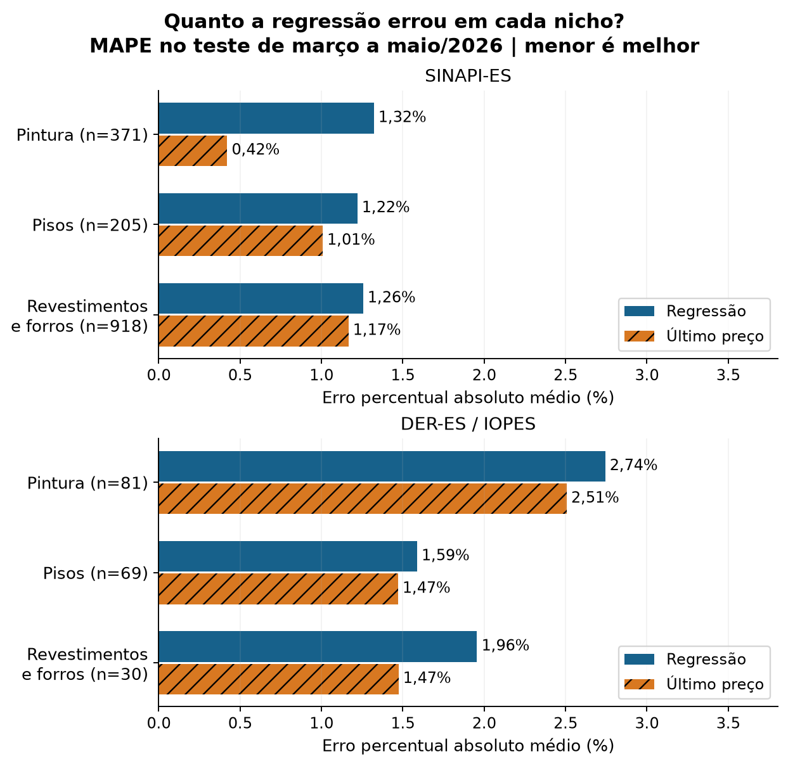

# Regressão | interpretação das estatísticas

A tabela reúne os mesmos valores do gráfico e acrescenta a mediana. MAPE = média de 100 × |previsto - publicado| / publicado. A referência último preço é calculada nas mesmas observações, permitindo uma comparação pareada.

Exemplo de interpretação: um erro de 1,32% significa que a distância percentual absoluta entre estimativa e custo publicado foi, em média, 1,32%. Não significa probabilidade de acerto, aumento do preço, economia contratual nem precisão garantida para um serviço novo.

A mediana divide as observações em duas metades: metade dos erros é menor ou igual a ela. Quando a média supera muito a mediana, alguns erros maiores estão influenciando a média. Os CSVs estatisticas_nichos.csv e estatisticas_recortes.csv conservam P90, dispersão e indicadores complementares.

Comparação do MAPE por fonte: SINAPI-ES: regressão superior ao último preço em 0 de 3 nichos; DER-ES / IOPES: regressão superior ao último preço em 0 de 3 nichos. Os resultados sustentam manter a referência simples na avaliação e estudar novos atributos e horizontes em experimentos futuros.

| Fonte | Nicho | n | MAPE modelo | Último preço | Mediana |
| --- | --- | --- | --- | --- | --- |
| SINAPI-ES | Pintura | 371 | 1,32% | 0,42% | 1,33% |
| SINAPI-ES | Pisos | 205 | 1,22% | 1,01% | 0,83% |
| SINAPI-ES | Revestimentos e forros | 918 | 1,26% | 1,17% | 0,97% |
| DER-ES / IOPES | Pintura | 81 | 2,74% | 2,51% | 2,02% |
| DER-ES / IOPES | Pisos | 69 | 1,59% | 1,47% | 0,78% |
| DER-ES / IOPES | Revestimentos e forros | 30 | 1,96% | 1,47% | 0,79% |

[Código Python - modelos lineares, teste temporal e persistência](https://github.com/luferdias/ORCA-AI/blob/e20741b0214dff489147fa04739bb2a1ed44bc07/OrcaAI/ml/orca_ml/regressao.py)

[SINAPI-ES - estatísticas por nicho da regressão](https://github.com/luferdias/ORCA-AI/blob/e20741b0214dff489147fa04739bb2a1ed44bc07/OrcaAI/ml/outputs/entrega_ufg_acabamentos_2026-09-27/sinapi_es/regressao/estatisticas_nichos.csv)

[DER-ES/IOPES - estatísticas por nicho da regressão](https://github.com/luferdias/ORCA-AI/blob/e20741b0214dff489147fa04739bb2a1ed44bc07/OrcaAI/ml/outputs/entrega_ufg_acabamentos_2026-09-27/der_es/regressao/estatisticas_nichos.csv)

# 4. Pintura em detalhe | SINAPI-ES

Exemplo 96130: APLICAÇÃO MANUAL DE MASSA ACRÍLICA EM PAREDES EXTERNAS DE CASAS, UMA DEMÃO. AF_03/2024

O código foi escolhido para continuidade com a apresentação de regressão, sem selecionar pelo acerto. Os exemplos de SINAPI e DER ilustram seus próprios catálogos e não foram homologados como serviços tecnicamente equivalentes.

Este serviço pertence ao treino da classificação; nenhuma previsão de teste foi inventada para ele. No agrupamento, aparece no grupo 1 do K-Means selecionado.

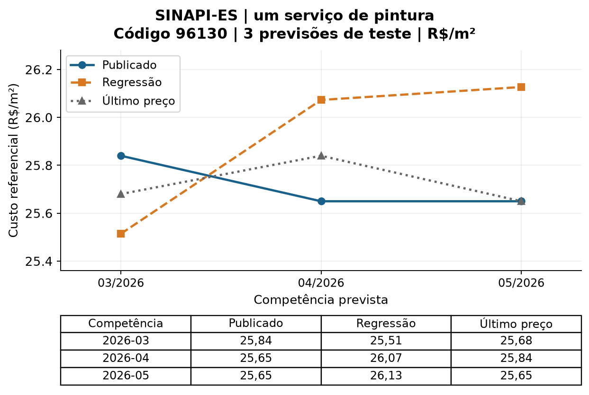

| Competência | Publicado R$/m² | Regressão R$/m² | Último R$/m² | Erro modelo % |
| --- | --- | --- | --- | --- |
| 2026-03 | 25,84 | 25,51 | 25,68 | 1,26 |
| 2026-04 | 25,65 | 26,07 | 25,84 | 1,65 |
| 2026-05 | 25,65 | 26,13 | 25,65 | 1,86 |

# 4. Pintura em detalhe | DER-ES / IOPES

Exemplo 190115: Pintura, sobre paredes e forros, aplicação manual, com duas demãos de tinta látex PVA premium, referência Suvinil, Coral e Metalatex, inclusive uma demão de liquido selador PVA, referência Suvinil, Coral ou Metalatex ou equivalente

O código foi escolhido para continuidade com a apresentação de regressão, sem selecionar pelo acerto. Os exemplos de SINAPI e DER ilustram seus próprios catálogos e não foram homologados como serviços tecnicamente equivalentes.

Este serviço pertence ao treino da classificação; nenhuma previsão de teste foi inventada para ele. No agrupamento, aparece no grupo 0 do diagnóstico, sem candidato aceito.

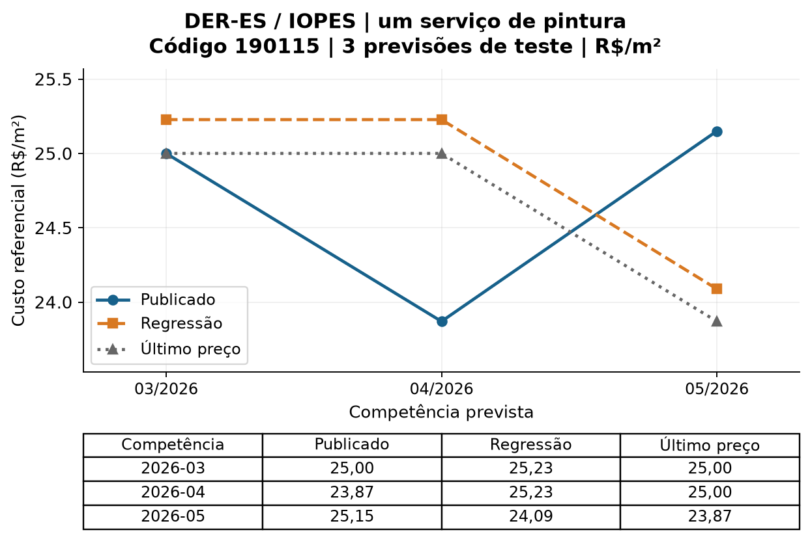

| Competência | Publicado R$/m² | Regressão R$/m² | Último R$/m² | Erro modelo % |
| --- | --- | --- | --- | --- |
| 2026-03 | 25,00 | 25,23 | 25,00 | 0,91 |
| 2026-04 | 23,87 | 25,23 | 25,00 | 5,69 |
| 2026-05 | 25,15 | 24,09 | 23,87 | 4,22 |

# 5. Classificação: seleção independente do teste

As barras azuis mostram a média de F1 macro na validação para o melhor candidato de cada algoritmo; os traços representam o desvio entre três folds, não um intervalo de confiança. As barras laranja mostram o teste reservado. A classe majoritária é a referência e não participou da seleção.

Um algoritmo pode obter resultado maior no teste e ainda assim não ser o selecionado. A escolha continua baseada na validação, evitando selecionar retrospectivamente o modelo que mais acertou o teste. F1 macro tem escala de 0 a 1 e não deve ser apresentado como porcentagem de serviços corretamente classificados.

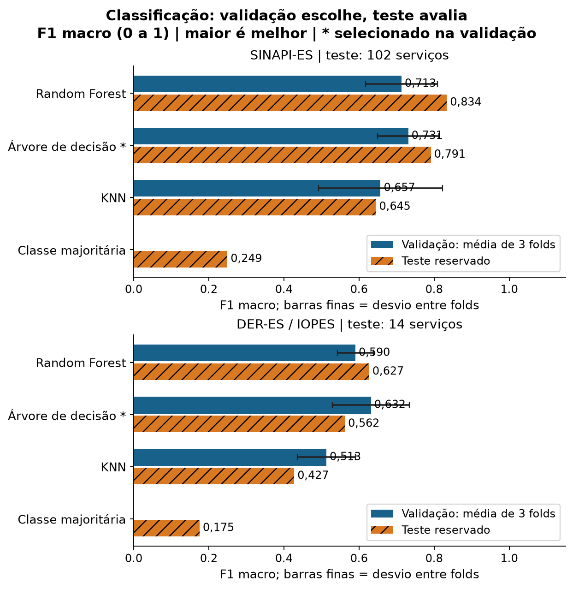

[Código Python - classificação, validação e escolha do modelo](https://github.com/luferdias/ORCA-AI/blob/e20741b0214dff489147fa04739bb2a1ed44bc07/OrcaAI/ml/orca_ml/classificacao.py)

[Executar somente a classificação - executar_classificacao.py](https://github.com/luferdias/ORCA-AI/blob/e20741b0214dff489147fa04739bb2a1ed44bc07/OrcaAI/ml/executar_classificacao.py)

# 6. Matriz de confusão | SINAPI-ES

Modelo selecionado: Árvore de decisão. Treino: 412 serviços em 89 grupos de variantes. Teste: 102 serviços em 21 grupos. F1 macro = 0,791; acurácia balanceada = 0,831; acurácia = 81,4%.

Leia cada linha como a classe real. A diagonal contém acertos; as outras células mostram para qual classe os serviços foram confundidos. O percentual dentro de cada célula usa o total da própria linha. Precisão pergunta se as sugestões da classe acertaram; recall pergunta quantos serviços reais da classe foram reconhecidos.

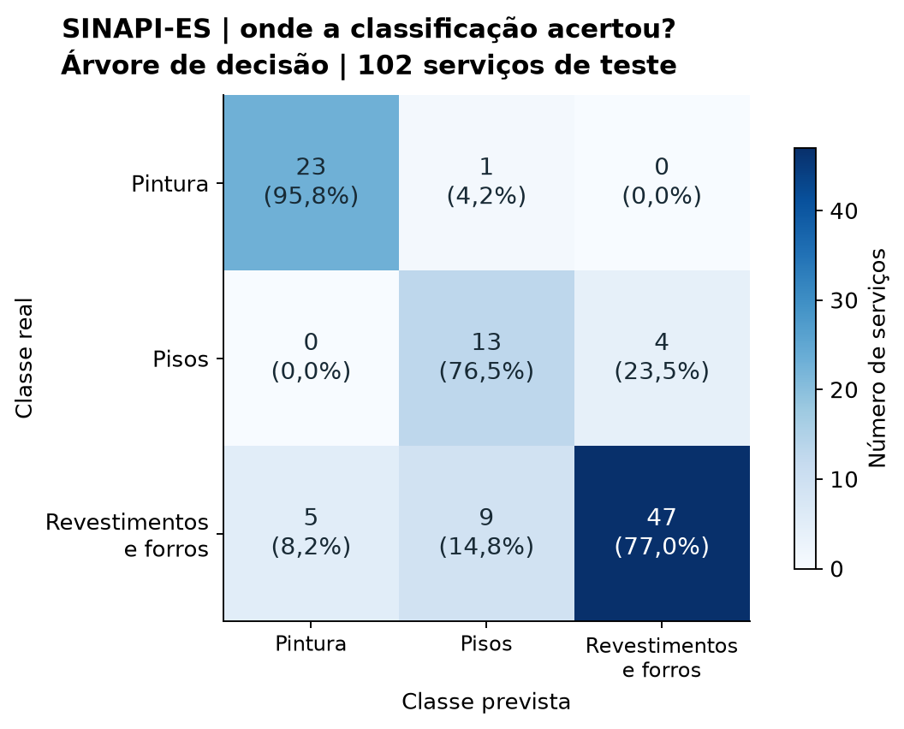

| Classe | n teste | Precisão | Recall | F1 |
| --- | --- | --- | --- | --- |
| Pintura | 24 | 0,821 | 0,958 | 0,885 |
| Pisos | 17 | 0,565 | 0,765 | 0,650 |
| Revestimentos e forros | 61 | 0,922 | 0,770 | 0,839 |

[Métricas de teste dos classificadores](https://github.com/luferdias/ORCA-AI/blob/e20741b0214dff489147fa04739bb2a1ed44bc07/OrcaAI/ml/outputs/entrega_ufg_acabamentos_2026-09-27/sinapi_es/classificacao/metricas_teste.csv)

[Previsões por serviço para conferir acertos e erros](https://github.com/luferdias/ORCA-AI/blob/e20741b0214dff489147fa04739bb2a1ed44bc07/OrcaAI/ml/outputs/entrega_ufg_acabamentos_2026-09-27/sinapi_es/classificacao/previsoes.csv)

[Partições de treino e teste, com os grupos de variantes](https://github.com/luferdias/ORCA-AI/blob/e20741b0214dff489147fa04739bb2a1ed44bc07/OrcaAI/ml/outputs/entrega_ufg_acabamentos_2026-09-27/sinapi_es/classificacao/particoes.csv)

# 6. Matriz de confusão | DER-ES / IOPES

Modelo selecionado: Árvore de decisão. Treino: 56 serviços em 43 grupos de variantes. Teste: 14 serviços em 9 grupos. F1 macro = 0,562; acurácia balanceada = 0,567; acurácia = 57,1%.

Leia cada linha como a classe real. A diagonal contém acertos; as outras células mostram para qual classe os serviços foram confundidos. O percentual dentro de cada célula usa o total da própria linha. Precisão pergunta se as sugestões da classe acertaram; recall pergunta quantos serviços reais da classe foram reconhecidos.

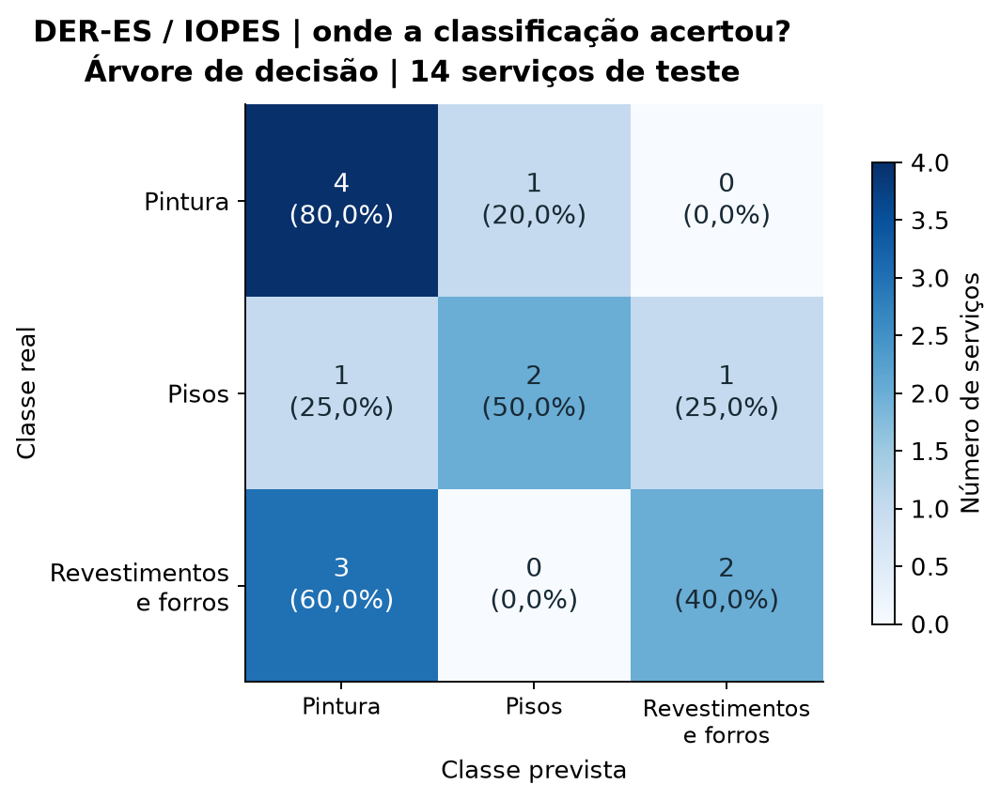

| Classe | n teste | Precisão | Recall | F1 |
| --- | --- | --- | --- | --- |
| Pintura | 5 | 0,500 | 0,800 | 0,615 |
| Pisos | 4 | 0,667 | 0,500 | 0,571 |
| Revestimentos e forros | 5 | 0,667 | 0,400 | 0,500 |

[Métricas de teste dos classificadores](https://github.com/luferdias/ORCA-AI/blob/e20741b0214dff489147fa04739bb2a1ed44bc07/OrcaAI/ml/outputs/entrega_ufg_acabamentos_2026-09-27/der_es/classificacao/metricas_teste.csv)

[Previsões por serviço para conferir acertos e erros](https://github.com/luferdias/ORCA-AI/blob/e20741b0214dff489147fa04739bb2a1ed44bc07/OrcaAI/ml/outputs/entrega_ufg_acabamentos_2026-09-27/der_es/classificacao/previsoes.csv)

[Partições de treino e teste, com os grupos de variantes](https://github.com/luferdias/ORCA-AI/blob/e20741b0214dff489147fa04739bb2a1ed44bc07/OrcaAI/ml/outputs/entrega_ufg_acabamentos_2026-09-27/der_es/classificacao/particoes.csv)

# 7. Agrupamento | SINAPI-ES

Foi selecionado k=3, com silhouette 0,388, entre os candidatos elegíveis. Cada grupo precisava de ao menos 26 serviços.

Silhouette maior só torna um candidato preferível quando os demais critérios também são atendidos. Davies-Bouldin favorece valores menores; Calinski-Harabasz favorece valores maiores dentro deste mesmo conjunto. A estabilidade por grupos de variantes é a verificação mais conservadora quando variantes semelhantes estão presentes.

A média e o mínimo do ARI são apresentados juntos: uma mediana elevada pode esconder uma reamostragem instável. A estabilidade descreve reajustes no catálogo; não mede desempenho preditivo em uma obra nova.

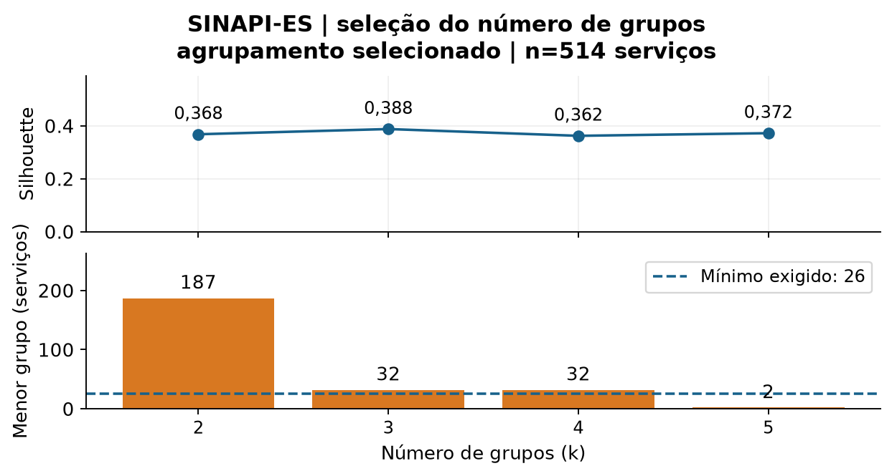

| k | Elegível | Silhouette | Davies-Bouldin | Calinski-H. |
| --- | --- | --- | --- | --- |
| 2 | sim | 0,368 | 1,297 | 232,2 |
| 3 | sim | 0,388 | 1,071 | 203,2 |
| 4 | sim | 0,362 | 1,002 | 219,1 |
| 5 | não | 0,372 | 0,899 | 221,3 |

| Reajuste | ARI médio | ARI mínimo |
| --- | --- | --- |
| Outras sementes | 1,000 | 1,000 |
| 80% dos serviços | 1,000 | 1,000 |
| 80% dos grupos de variantes | 0,906 | 0,514 |

[Código Python - K-Means, seleção de k e estabilidade](https://github.com/luferdias/ORCA-AI/blob/e20741b0214dff489147fa04739bb2a1ed44bc07/OrcaAI/ml/orca_ml/agrupamento.py)

[Tabela de candidatos a k e critérios de elegibilidade](https://github.com/luferdias/ORCA-AI/blob/e20741b0214dff489147fa04739bb2a1ed44bc07/OrcaAI/ml/outputs/entrega_ufg_acabamentos_2026-09-27/sinapi_es/agrupamento/candidatos_k.csv)

# 8. Perfis de recursos | SINAPI-ES

A projeção PCA mostra 59,9% da variância em duas dimensões. O K-Means calcula distâncias nos dez atributos padronizados, não apenas neste desenho. Os números dos grupos são identificadores arbitrários, sem correspondência automática com os grupos da outra base.

As barras mostram a média das participações aproximadas de recursos de cada grupo. Horas de equipamento iguais a zero significam ausência de folhas mensuradas em H, não ausência de equipamento: aquisições podem estar representadas em outras unidades.

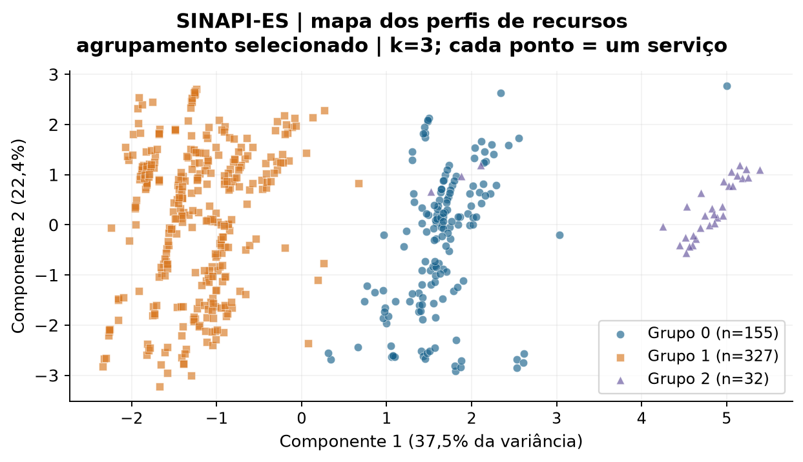

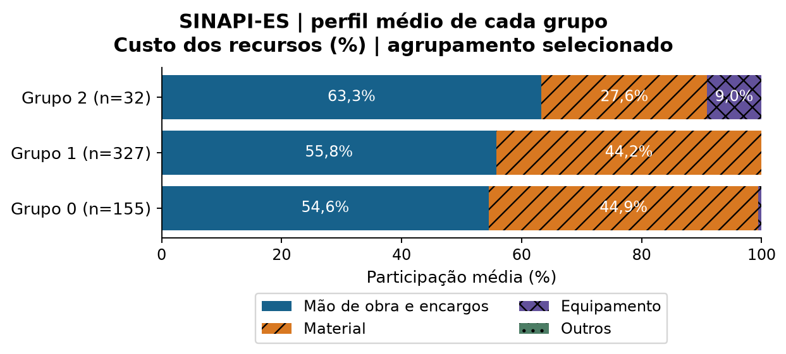

# 7. Agrupamento | DER-ES / IOPES

Nenhum k foi aceito. O menor k calculável, 2, é apresentado apenas como diagnóstico. O critério mínimo era 4 serviços no menor grupo; esse critério não foi alterado após observar os dados.

Silhouette maior só torna um candidato preferível quando os demais critérios também são atendidos. Davies-Bouldin favorece valores menores; Calinski-Harabasz favorece valores maiores dentro deste mesmo conjunto. A estabilidade por grupos de variantes é a verificação mais conservadora quando variantes semelhantes estão presentes.

A média e o mínimo do ARI são apresentados juntos: uma mediana elevada pode esconder uma reamostragem instável. A estabilidade descreve reajustes no catálogo; não mede desempenho preditivo em uma obra nova.

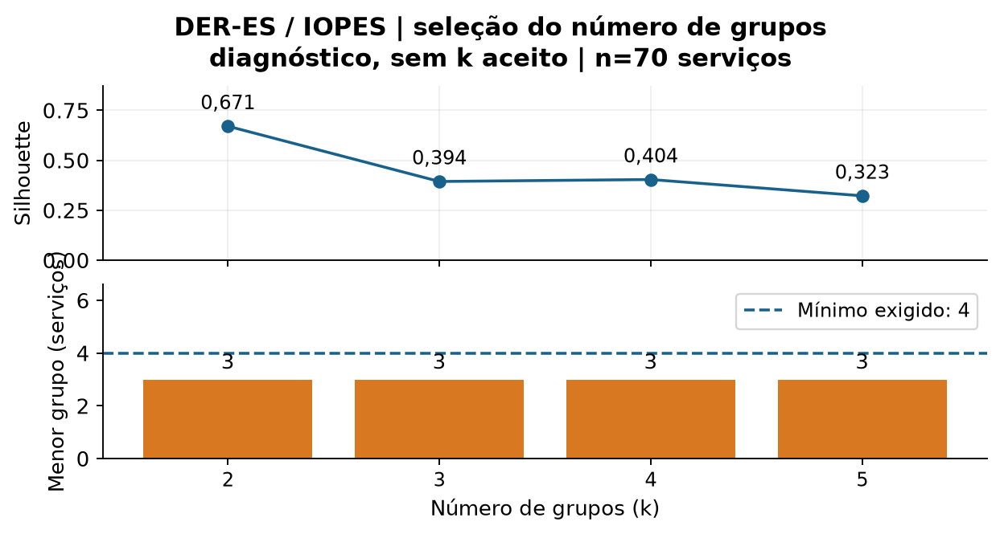

| k | Elegível | Silhouette | Davies-Bouldin | Calinski-H. |
| --- | --- | --- | --- | --- |
| 2 | não | 0,671 | 0,609 | 33,3 |
| 3 | não | 0,394 | 0,969 | 39,9 |
| 4 | não | 0,404 | 0,760 | 44,0 |
| 5 | não | 0,323 | 0,904 | 41,8 |

| Reajuste | ARI médio | ARI mínimo |
| --- | --- | --- |
| Outras sementes | 1,000 | 1,000 |
| 80% dos serviços | 1,000 | 1,000 |
| 80% dos grupos de variantes | 0,953 | 0,055 |

[Código Python - K-Means, seleção de k e estabilidade](https://github.com/luferdias/ORCA-AI/blob/e20741b0214dff489147fa04739bb2a1ed44bc07/OrcaAI/ml/orca_ml/agrupamento.py)

[Tabela de candidatos a k e critérios de elegibilidade](https://github.com/luferdias/ORCA-AI/blob/e20741b0214dff489147fa04739bb2a1ed44bc07/OrcaAI/ml/outputs/entrega_ufg_acabamentos_2026-09-27/der_es/agrupamento/candidatos_k.csv)

# 8. Perfis de recursos | DER-ES / IOPES

A projeção PCA mostra 72,2% da variância em duas dimensões. O K-Means calcula distâncias nos dez atributos padronizados, não apenas neste desenho. Todos os perfis abaixo são diagnósticos; nenhum agrupamento foi aceito.

As barras mostram a média das participações aproximadas de recursos de cada grupo. Horas de equipamento iguais a zero significam ausência de folhas mensuradas em H, não ausência de equipamento: aquisições podem estar representadas em outras unidades.

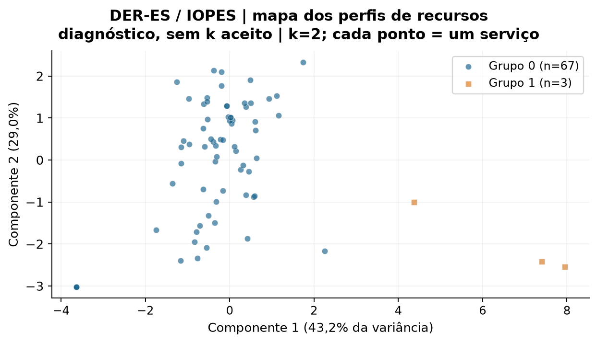

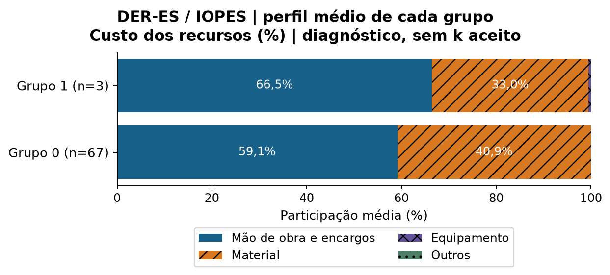

# 9. Consolidação, discussão e conclusão

SINAPI-ES: o classificador selecionado obteve F1 macro 0,791, frente a 0,249 da classe majoritária. O agrupamento possui candidato elegível, sujeito à revisão dos perfis.

DER-ES / IOPES: o classificador selecionado obteve F1 macro 0,562, frente a 0,175 da classe majoritária. O agrupamento não passou pelos critérios; revisar atributos e tratamento dos poucos perfis raros é uma evolução futura, que exige novo experimento.

A contribuição ao ORCA-AI é oferecer três recursos complementares: cenários de custo com referência simples, sugestão de classe para composições estruturadas e exploração de perfis. Um agrupamento não comprova substituição técnica de serviços; uma sugestão de classe exige conferência antes do uso profissional.

Limitações: catálogo pequeno no DER, classes derivadas e não homologadas, dependência residual entre variantes, história revisada, participação de preços SP no SINAPI e diferentes convenções de encargos. A comparação é descritiva em cada fonte. Não foram estimados intervalos de confiança tratando observações dependentes como independentes.

As três tarefas do enunciado foram executadas e seus resultados preservados, incluindo resultados desfavoráveis. Aprendizado por reforço permanece fora do escopo. A continuidade recomendada é revisar os rótulos e os perfis raros, testar em novas composições e ampliar a avaliação temporal sem reutilizar este teste para decisões de ajuste.

| Aspecto | Regressão | Classificação | Agrupamento |
| --- | --- | --- | --- |
| Unidade | Serviço-mês | Serviço de maio | Serviço de maio |
| Supervisão | Custo conhecido como alvo | Nicho como rótulo | Sem rótulo no ajuste |
| Modelo | Linear simples/múltipla | RF, árvore e KNN | K-Means |
| Referência | Último preço | Classe majoritária | Critério de tamanho e estabilidade |
| Indicador | MAPE, MAE, RMSE, MSE | F1 macro e matriz de erros | Silhouette, DB, CH e ARI |
| Decisão apoiada | Planejamento do próximo custo | Conferência da família técnica | Exploração de perfis semelhantes |

# 10. Reprodução e referências

No VS Code, abra a pasta OrcaAI/ml, selecione o Python de .venv e execute executar_estudo.py. Para recriar somente a apresentação, utilize gerar_relatorio_estudo.py com a pasta da execução concluída. O relatório não treina modelos. Cada nova execução usa uma pasta nova para preservar resultados anteriores.

Os CSVs de dados, previsões, partições, matrizes, centroides, projeções e métricas ficam nas pastas de cada fonte. execucao_estudo.json registra parâmetros e hashes do código; manifesto_relatorio.json registra os hashes dos arquivos efetivamente usados nesta apresentação. As sementes e versões de Python/scikit-learn estão nos resumos das tarefas.

SINAPI-ES: ZIP SHA-256 928df42a952625eb12d41baf2b5ab17e1207af6e7881cb9f1c7fcac4708400e3. Serviços com preço SP: 54. Diferença máxima entre soma das folhas sem truncamento e custo publicado: 0,7811%.

DER-ES / IOPES: ZIP SHA-256 9d7efd575c10dc676bc49f5acb5630fa9b3cd2b98449be07612e1891e8d213f6. Serviços com preço SP: 0. Diferença máxima entre soma das folhas sem truncamento e custo publicado: 0,4576%.

Materiais da disciplina: OrcaAI/spec/ml_ufg/mapa_materiais_disciplina.md identifica as aulas e exemplos que fundamentaram a escolha de LinearRegression, Random Forest, árvore, KNN e K-Means. O código, os dados derivados e as tabelas de auditoria acompanham esta entrega.

[[1] CAIXA - SINAPI: tabelas e documentação oficial](https://www.caixa.gov.br/poder-publico/modernizacao-gestao/sinapi/Paginas/default.aspx)

[[2] DER-ES - referencial de preços de edificações](https://der.es.gov.br/referencial-de-precos-edificacoes)

[[3] scikit-learn - divisão estratificada por grupos](https://scikit-learn.org/stable/modules/generated/sklearn.model_selection.StratifiedGroupKFold.html)

[[4] scikit-learn - métricas de avaliação](https://scikit-learn.org/stable/modules/model_evaluation.html)

[[5] scikit-learn - agrupamento e seus indicadores](https://scikit-learn.org/stable/modules/clustering.html)

# Apêndice A. Como executar e conferir o trabalho

1. Baixe a versão pública fixada ou clone o projeto. Para reproduzir exatamente a versão avaliada, use git checkout e20741b0214dff489147fa04739bb2a1ed44bc07. No VS Code, abra a pasta OrcaAI/ml.

2. Use Python 3.12. Crie o ambiente com python3.12 -m venv .venv; ative-o com source .venv/bin/activate (macOS/Linux) ou .venv\Scripts\Activate.ps1 (PowerShell). Instale as dependências com python -m pip install -r requirements.txt.

3. Execute python executar_estudo.py. O programa lê os ZIPs e datasets incluídos no projeto, processa as fontes separadamente e cria uma nova pasta de resultados. Esse comando refaz as três tarefas no recorte de pintura, pisos e revestimentos/forros; preserve a estrutura do repositório.

4. Para executar uma única tarefa, use python executar_classificacao.py ou python executar_agrupamento.py. O script executar_regressao.py preserva a avaliação original mais ampla; o recorte comum das três tarefas é executado por executar_estudo.py.

5. Para conferir a implementação, instale python -m pip install -r requirements-dev.txt e rode python -m pytest -q. A versão experimental publicada passou por 221 testes e nove subtestes. Cada teste automatizado verifica uma regra do programa; isso não equivale a validação profissional dos modelos.

Arquivos CSV grandes podem não ter prévia no GitHub. Use Download raw file ou baixe o repositório para ler os dados completos. Os links dos apêndices priorizam as tabelas compactas do recorte. O mapa das aulas descreve os materiais consultados; arquivos originais externos da disciplina não fazem parte deste repositório.

[Executar as três tarefas no recorte - executar_estudo.py](https://github.com/luferdias/ORCA-AI/blob/e20741b0214dff489147fa04739bb2a1ed44bc07/OrcaAI/ml/executar_estudo.py)

[Executar a regressão original - executar_regressao.py](https://github.com/luferdias/ORCA-AI/blob/e20741b0214dff489147fa04739bb2a1ed44bc07/OrcaAI/ml/executar_regressao.py)

[Executar a classificação - executar_classificacao.py](https://github.com/luferdias/ORCA-AI/blob/e20741b0214dff489147fa04739bb2a1ed44bc07/OrcaAI/ml/executar_classificacao.py)

[Executar o agrupamento - executar_agrupamento.py](https://github.com/luferdias/ORCA-AI/blob/e20741b0214dff489147fa04739bb2a1ed44bc07/OrcaAI/ml/executar_agrupamento.py)

[Dependências e versões - requirements.txt](https://github.com/luferdias/ORCA-AI/blob/e20741b0214dff489147fa04739bb2a1ed44bc07/OrcaAI/ml/requirements.txt)

[Testes automatizados das rotinas](https://github.com/luferdias/ORCA-AI/tree/e20741b0214dff489147fa04739bb2a1ed44bc07/OrcaAI/ml/tests)

[Preparação de dados - preparar_dados.py](https://github.com/luferdias/ORCA-AI/blob/e20741b0214dff489147fa04739bb2a1ed44bc07/OrcaAI/ml/preparar_dados.py)

[Leitor e conciliação das composições SINAPI](https://github.com/luferdias/ORCA-AI/blob/e20741b0214dff489147fa04739bb2a1ed44bc07/OrcaAI/ml/orca_ml/sinapi_composicoes.py)

[Leitor e conciliação das composições DER-ES](https://github.com/luferdias/ORCA-AI/blob/e20741b0214dff489147fa04739bb2a1ed44bc07/OrcaAI/ml/orca_ml/der_composicoes.py)

[Mapa dos conteúdos da disciplina usados no projeto](https://github.com/luferdias/ORCA-AI/blob/e20741b0214dff489147fa04739bb2a1ed44bc07/OrcaAI/spec/ml_ufg/mapa_materiais_disciplina.md)

# Apêndice B. Evidências por fonte | SINAPI-ES

Este índice permite seguir cada conclusão até a tabela que a originou. Código e descrição identificam serviços dentro da própria fonte; os códigos SINAPI e DER não são pares de equivalência técnica.

Na classificação, compare a validação, que escolhe o algoritmo, com o teste reservado, que mede o resultado final. No agrupamento DER, preserve a indicação de diagnóstico: nenhum candidato cumpriu o tamanho mínimo de grupo.

[Dataset: atributos e classes de cada serviço](https://github.com/luferdias/ORCA-AI/blob/e20741b0214dff489147fa04739bb2a1ed44bc07/OrcaAI/ml/outputs/entrega_ufg_acabamentos_2026-09-27/sinapi_es/dados/dataset_acabamentos.csv)

[Recursos extraídos das composições analíticas](https://github.com/luferdias/ORCA-AI/blob/e20741b0214dff489147fa04739bb2a1ed44bc07/OrcaAI/ml/outputs/entrega_ufg_acabamentos_2026-09-27/sinapi_es/dados/recursos_folha.csv)

[Auditoria da extração e conciliação dos custos](https://github.com/luferdias/ORCA-AI/blob/e20741b0214dff489147fa04739bb2a1ed44bc07/OrcaAI/ml/outputs/entrega_ufg_acabamentos_2026-09-27/sinapi_es/dados/auditoria_extracao.json)

[Populações: serviços presentes em cada tarefa](https://github.com/luferdias/ORCA-AI/blob/e20741b0214dff489147fa04739bb2a1ed44bc07/OrcaAI/ml/outputs/entrega_ufg_acabamentos_2026-09-27/sinapi_es/dados/populacoes_tarefas.csv)

[Regressão: publicado, previsto e persistência por observação](https://github.com/luferdias/ORCA-AI/blob/e20741b0214dff489147fa04739bb2a1ed44bc07/OrcaAI/ml/outputs/entrega_ufg_acabamentos_2026-09-27/sinapi_es/regressao/previsoes_pareadas.csv)

[Regressão: estatísticas agregadas por nicho](https://github.com/luferdias/ORCA-AI/blob/e20741b0214dff489147fa04739bb2a1ed44bc07/OrcaAI/ml/outputs/entrega_ufg_acabamentos_2026-09-27/sinapi_es/regressao/estatisticas_nichos.csv)

[Classificação: métricas da validação usada na seleção](https://github.com/luferdias/ORCA-AI/blob/e20741b0214dff489147fa04739bb2a1ed44bc07/OrcaAI/ml/outputs/entrega_ufg_acabamentos_2026-09-27/sinapi_es/classificacao/metricas_cv.csv)

[Classificação: matriz de confusão em formato de tabela](https://github.com/luferdias/ORCA-AI/blob/e20741b0214dff489147fa04739bb2a1ed44bc07/OrcaAI/ml/outputs/entrega_ufg_acabamentos_2026-09-27/sinapi_es/classificacao/confusao.csv)

[Classificação: parâmetros, versões e resumo](https://github.com/luferdias/ORCA-AI/blob/e20741b0214dff489147fa04739bb2a1ed44bc07/OrcaAI/ml/outputs/entrega_ufg_acabamentos_2026-09-27/sinapi_es/classificacao/resumo.json)

[Agrupamento: grupo atribuído a cada serviço](https://github.com/luferdias/ORCA-AI/blob/e20741b0214dff489147fa04739bb2a1ed44bc07/OrcaAI/ml/outputs/entrega_ufg_acabamentos_2026-09-27/sinapi_es/agrupamento/atribuicoes.csv)

[Agrupamento: médias dos atributos de cada grupo](https://github.com/luferdias/ORCA-AI/blob/e20741b0214dff489147fa04739bb2a1ed44bc07/OrcaAI/ml/outputs/entrega_ufg_acabamentos_2026-09-27/sinapi_es/agrupamento/centroides.csv)

[Agrupamento: resultados das verificações de estabilidade](https://github.com/luferdias/ORCA-AI/blob/e20741b0214dff489147fa04739bb2a1ed44bc07/OrcaAI/ml/outputs/entrega_ufg_acabamentos_2026-09-27/sinapi_es/agrupamento/estabilidade.csv)

[Agrupamento: seleção, diagnóstico e resumo](https://github.com/luferdias/ORCA-AI/blob/e20741b0214dff489147fa04739bb2a1ed44bc07/OrcaAI/ml/outputs/entrega_ufg_acabamentos_2026-09-27/sinapi_es/agrupamento/resumo.json)

[Todas as tabelas e modelos desta fonte](https://github.com/luferdias/ORCA-AI/tree/e20741b0214dff489147fa04739bb2a1ed44bc07/OrcaAI/ml/outputs/entrega_ufg_acabamentos_2026-09-27/sinapi_es/)

# Apêndice B. Evidências por fonte | DER-ES / IOPES

Este índice permite seguir cada conclusão até a tabela que a originou. Código e descrição identificam serviços dentro da própria fonte; os códigos SINAPI e DER não são pares de equivalência técnica.

Na classificação, compare a validação, que escolhe o algoritmo, com o teste reservado, que mede o resultado final. No agrupamento DER, preserve a indicação de diagnóstico: nenhum candidato cumpriu o tamanho mínimo de grupo.

[Dataset: atributos e classes de cada serviço](https://github.com/luferdias/ORCA-AI/blob/e20741b0214dff489147fa04739bb2a1ed44bc07/OrcaAI/ml/outputs/entrega_ufg_acabamentos_2026-09-27/der_es/dados/dataset_acabamentos.csv)

[Recursos extraídos das composições analíticas](https://github.com/luferdias/ORCA-AI/blob/e20741b0214dff489147fa04739bb2a1ed44bc07/OrcaAI/ml/outputs/entrega_ufg_acabamentos_2026-09-27/der_es/dados/recursos_folha.csv)

[Auditoria da extração e conciliação dos custos](https://github.com/luferdias/ORCA-AI/blob/e20741b0214dff489147fa04739bb2a1ed44bc07/OrcaAI/ml/outputs/entrega_ufg_acabamentos_2026-09-27/der_es/dados/auditoria_extracao.json)

[Populações: serviços presentes em cada tarefa](https://github.com/luferdias/ORCA-AI/blob/e20741b0214dff489147fa04739bb2a1ed44bc07/OrcaAI/ml/outputs/entrega_ufg_acabamentos_2026-09-27/der_es/dados/populacoes_tarefas.csv)

[Regressão: publicado, previsto e persistência por observação](https://github.com/luferdias/ORCA-AI/blob/e20741b0214dff489147fa04739bb2a1ed44bc07/OrcaAI/ml/outputs/entrega_ufg_acabamentos_2026-09-27/der_es/regressao/previsoes_pareadas.csv)

[Regressão: estatísticas agregadas por nicho](https://github.com/luferdias/ORCA-AI/blob/e20741b0214dff489147fa04739bb2a1ed44bc07/OrcaAI/ml/outputs/entrega_ufg_acabamentos_2026-09-27/der_es/regressao/estatisticas_nichos.csv)

[Classificação: métricas da validação usada na seleção](https://github.com/luferdias/ORCA-AI/blob/e20741b0214dff489147fa04739bb2a1ed44bc07/OrcaAI/ml/outputs/entrega_ufg_acabamentos_2026-09-27/der_es/classificacao/metricas_cv.csv)

[Classificação: matriz de confusão em formato de tabela](https://github.com/luferdias/ORCA-AI/blob/e20741b0214dff489147fa04739bb2a1ed44bc07/OrcaAI/ml/outputs/entrega_ufg_acabamentos_2026-09-27/der_es/classificacao/confusao.csv)

[Classificação: parâmetros, versões e resumo](https://github.com/luferdias/ORCA-AI/blob/e20741b0214dff489147fa04739bb2a1ed44bc07/OrcaAI/ml/outputs/entrega_ufg_acabamentos_2026-09-27/der_es/classificacao/resumo.json)

[Agrupamento: grupo atribuído a cada serviço](https://github.com/luferdias/ORCA-AI/blob/e20741b0214dff489147fa04739bb2a1ed44bc07/OrcaAI/ml/outputs/entrega_ufg_acabamentos_2026-09-27/der_es/agrupamento/atribuicoes.csv)

[Agrupamento: médias dos atributos de cada grupo](https://github.com/luferdias/ORCA-AI/blob/e20741b0214dff489147fa04739bb2a1ed44bc07/OrcaAI/ml/outputs/entrega_ufg_acabamentos_2026-09-27/der_es/agrupamento/centroides.csv)

[Agrupamento: resultados das verificações de estabilidade](https://github.com/luferdias/ORCA-AI/blob/e20741b0214dff489147fa04739bb2a1ed44bc07/OrcaAI/ml/outputs/entrega_ufg_acabamentos_2026-09-27/der_es/agrupamento/estabilidade.csv)

[Agrupamento: seleção, diagnóstico e resumo](https://github.com/luferdias/ORCA-AI/blob/e20741b0214dff489147fa04739bb2a1ed44bc07/OrcaAI/ml/outputs/entrega_ufg_acabamentos_2026-09-27/der_es/agrupamento/resumo.json)

[Todas as tabelas e modelos desta fonte](https://github.com/luferdias/ORCA-AI/tree/e20741b0214dff489147fa04739bb2a1ed44bc07/OrcaAI/ml/outputs/entrega_ufg_acabamentos_2026-09-27/der_es/)
