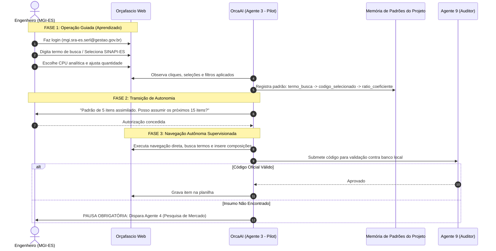

# Protocolo de Aprendizado por Demonstração (LfD)
## Interação Híbrida OrcaAI - Orçafascio Web

---

## 1. Visão Geral do Protocolo

O protocolo de **Aprendizado por Demonstração (*Learning from Demonstration - LfD*)** permite que o OrcaAI absorva o raciocínio prático e as escolhas do engenheiro no software Orçafascio antes de operar de modo autônomo. Isso elimina alucinações de dados e garante total alinhamento às preferências do órgão.

---

## 2. As Três Fases da Operação

### Fase 1: Co-Pilot & Gravação de Demonstração
1. O engenheiro abre o navegador e acessa o [Orçafascio](https://app.orcafascio.com/).
2. O OrcaAI ativa o `OrcafascioPilot` em modo observador passivo.
3. Para cada ação do engenheiro, o sistema registra:
   - Base de dados utilizada (`SINAPI`, `IOPES`, `ORSE`, etc.).
   - Estado/Praça selecionada (`Espírito Santo`, `Vitória`).
   - Termo de consulta digitado no campo de busca.
   - Código selecionado e tipo da composição (sintética ou analítica).
   - Quantitativo e eventual ajuste de produtividade ou perdas.
   - Percentual de BDI aplicado na tela.

### Fase 2: Assimilação e Síntese de Padrão
1. O OrcaAI constrói uma matriz de correspondência entre o escopo descrito no memorial e as composições escolhidas.
2. O sistema gera um resumo de calibração:
   - Taxa de desoneração detectada (Não Desonerado por padrão).
   - Famílias de composições prioritárias (ex: 88xxx para alvenaria/pintura, 98xxx para instalações).
   - Validação de que não houve desvios de BDI (travado em 25%).

### Fase 3: Operação Autônoma com Trava de Segurança
1. O OrcaAI assume a inserção dos itens subsequentes da EAP no Orçafascio Web via automação de browser.
2. **Garantia Anti-Alucinação**:
   - Cada código selecionado na automação é validado em microssegundos contra as tabelas oficiais locais (`bases/`).
   - Se o Orçafascio retornar resultado duvidoso ou se a base oficial não tiver o serviço exato, a automação **interrompe a digitação** e emite alerta com solicitação de validação humana.
