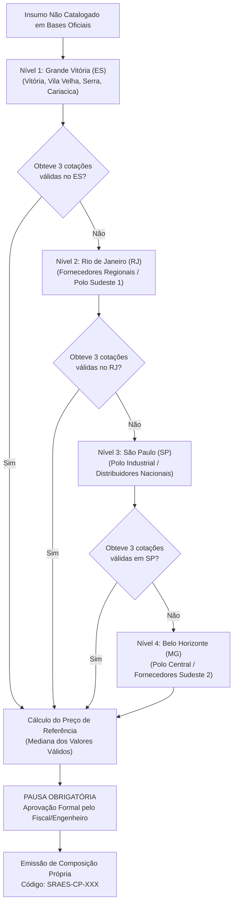

# Protocolo de Pesquisa de Mercado Escalonada
## Em Conformidade com a IN SEGES/ME nº 65/2021 e Lei nº 14.133/2021

---

## 1. Diretriz Metodológica

A pesquisa de mercado é acionada **exclusivamente** quando o insumo, equipamento ou serviço não constar em nenhuma das bases de dados oficiais vigentes (SINAPI, IOPES, SICRO, ORSE ou bases estaduais correlatas).

O OrcaAI executa uma **cascata de busca geográfica estruturada**, priorizando fornecedores locais para garantir a compatibilidade logística com o município de Vitória/ES.

---

## 2. A Cascata Geográfica de 4 Níveis

---

## 3. Requisitos Obrigatórios da Cotação

Conforme estabelecido no art. 5º da IN SEGES/ME nº 65/2021, cada cotação deve conter obrigatoriamente:

1. **Identificação Completa do Fornecedor**:
   - Razão Social e CNPJ ativo na Receita Federal.
   - Endereço físico, telefone e e-mail comercial.
   - Nome completo e cargo do consultor/vendedor responsável.
2. **Condições Comerciais**:
   - Data de emissão da proposta (validade máxima de 180 dias).
   - Descrição detalhada do material/serviço ofertado com marca, modelo e especificações técnicas.
   - Condição de frete explicitada (**CIF Vitória/ES** ou valor do frete destacado).
   - Tributação e condições de pagamento.
3. **Tratamento Estatístico**:
   - Preferência pela **Mediana** dos valores obtidos.
   - Descarte motivado de propostas que apresentem valores inexequíveis ou excessivamente elevados (anomalias estatísticas com desvio superior a 25% da média).

---

## 4. Integração com a Composição de Custos Unitários (CPU)

Ao obter as 3 propostas válidas e calculada a mediana do insumo de mercado:
- O insumo é registrado com o código `SRAES-INS-XXX`.
- A composição analítica de serviço que utiliza o insumo recebe o código `SRAES-CP-XXX`.
- Aplica-se o BDI de **25,00%** se for serviço ou **14,02%** se for fornecimento destacado de equipamento.
- O Mapa de Cotações com as propostas anexadas integra o dossiê final.
