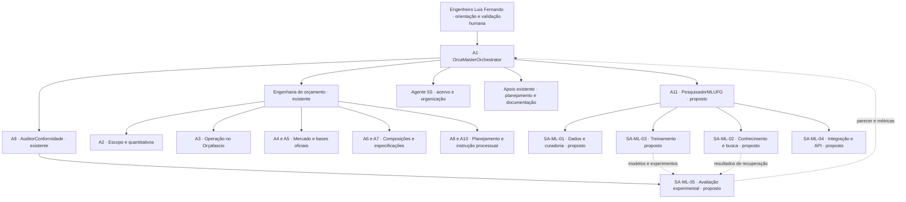

# ORCA-AI — estrutura agêntica para Machine Learning na UFG

Data: 27/09/2026. Estado: proposta de arquitetura e especificações para discussão.

**Atualização:** a etapa de regressão foi implementada no [módulo Python/VS Code](../../ml/README.md), com históricos SINAPI-ES e DER-ES separados. Os demais componentes deste pacote continuam como especificações para etapas futuras.

## 1. Objetivo

Incorporar Machine Learning ao ORCA-AI para o trabalho acadêmico da disciplina de Machine Learning do curso de Agentes Inteligentes da UFG. A rotina de orçamento de obras da SRA-ES, os projetos existentes e as decisões do usuário fornecem o contexto de aplicação.

O `OrcaMasterOrchestrator` continua coordenando o sistema. A extensão acadêmica organiza dados, experimentos e avaliação para devolver resultados úteis aos agentes de orçamento. O enunciado recebido pede regressão, classificação e agrupamento. O usuário confirmou que aprendizado por reforço ficará para uma evolução futura.

Este pacote entrega o organograma, as responsabilidades, a seleção de cinco skills e os contratos iniciais de dados e API. A regressão tem implementação local no módulo de ML. A execução automática dos novos papéis, a instalação das skills, a API e as outras tarefas de ML pertencem às etapas posteriores.

## 2. Documentos de referência

- [Proposta atual do projeto, alinhada às aulas da disciplina](proposta_projeto_ml_es.md) — escopo confirmado, modelos, execução em Python/VS Code, entregas e comparação SINAPI-ES × DER-ES/IOPES.
- [Mapa dos materiais da disciplina](mapa_materiais_disciplina.md) — PDFs, páginas e exemplos Python que fundamentam a seleção.
- [Evidências das planilhas SINAPI agosto/2026](evidencias_dados_sinapi_es.md) — campos do ES, composição analítica e cuidados de extração.
- [Viabilidade das três tarefas com dados estruturados no ES](../../docs/viabilidade_ml_dados_estruturados_es_2026-09-27.md) — análise posterior ao recebimento do enunciado, com opções para decisão.
- [Agentes e subagentes: responsabilidades e entregas](agentes_e_subagentes.md).
- [Cinco skills selecionadas e fontes verificadas](skills_selecionadas.md).
- [Dados, preservação do acervo e avaliação acadêmica](dados_e_avaliacao.md).
- [Bases de serviços e atualização por projeto](bases_servicos_e_atualizacao.md).
- [Auditoria das fontes oficiais em 27/09/2026](../../docs/auditoria_bases_referenciais_2026-09-27.md).
- [API Knowledge e configuração](api_knowledge.md).
- [Organograma em Mermaid](organograma.mmd).

## 3. Estrutura encontrada no repositório

| Componente | Situação verificada | Aproveitamento |
| --- | --- | --- |
| `OrcaAI/agents/` | 10 agentes numerados e o Agente 5S, definidos em Markdown | Manter os papéis de engenharia e a coordenação central |
| `.agent/agents/` | 6 agentes de apoio: orquestração, planejamento, exploração, documentação e dois perfis de orçamento | Reutilizar planejamento, inspeção e redação |
| `.agent/skills/` | 24 skills locais, com forte cobertura de orçamento e Orçafascio | Acrescentar capacidades de dados, ML e busca documental |
| `OrcaAI/skills/` | 4 módulos Python de orçamento, BDI, cronograma e validação | Continuar usando cálculos e verificações existentes |
| `OrcaAI/spec/` e `OrcaAI/workflows/` | Especificações e protocolos, incluindo aprendizado por demonstração | Usar como conhecimento de domínio e requisitos |
| `OrcaAI/projetos/` | 12 pastas `Item 01` a `Item 12`, além do acervo de projetos básicos e governança | Manter os originais nos seus caminhos atuais |
| `Projetos/` | Estrutura inicial criada nesta conversa, com pastas vazias e links `shared` | Manter até que uma eventual consolidação seja decidida |

As fichas de agentes descrevem papéis; sua presença não demonstra que exista um serviço autônomo em execução. A inspeção não encontrou pipeline de treinamento, inferência ou integração Qdrant implementado. O protocolo de aprendizado por demonstração descreve o comportamento desejado.

Fontes locais: [matriz de agentes](../../README.md), [orquestrador](../../agents/AGENTE_01_OrcaMasterOrchestrator.md), [protocolo LfD](../lfd_learning_protocol.md) e [arquitetura anterior da central](../../docs/central-orcamento-publico-agentes-arquitetura.md).

## 4. Organograma proposto



As linhas contínuas indicam coordenação. As pontilhadas indicam entrega para avaliação. Os cinco subagentes são papéis delegáveis por tarefa. A quantidade de funções no desenho não exige cinco processos permanentes. O avaliador recebe experimentos congelados e reporta ao A9; o treinador não aprova seu próprio resultado.

## 5. Como o conhecimento volta ao ORCA-AI

1. O A1 delimita uma pergunta acadêmica e os casos de orçamento aplicáveis.
2. O A11 organiza o experimento. O SA-ML-01 cataloga fontes e prepara exemplos com rastreabilidade.
3. A2, A5, A6 e o usuário ajudam a definir ou revisar os rótulos técnicos.
4. O SA-ML-02 produz o índice documental e avalia consultas com fontes identificadas.
5. O SA-ML-03 treina modelos sobre o dataset versionado e registra previsões e parâmetros.
6. O SA-ML-05 compara os resultados com uma referência simples e verifica a separação dos projetos entre treino e avaliação.
7. O A9 e o usuário avaliam as recomendações. O SA-ML-04 disponibiliza os resultados aprovados pela API Knowledge.
8. O A1 devolve a recomendação aos especialistas de orçamento. Aceites e correções são registrados para uma futura versão dos dados.

Consulta documental com embeddings e treinamento de um modelo são entregas distintas. Ambas precisam de avaliação própria. Acrescentar documentos ao índice não comprova melhoria de um modelo.

## 6. Organização futura dentro do ORCA-AI

A proposta aproveita o núcleo `OrcaAI/` atual. Os diretórios abaixo marcados como futuros não foram criados nesta etapa:

```text
ORCA-AI/
├── .agent/                      # Agentes de apoio, skills e workflows existentes
├── OrcaAI/
│   ├── agents/                  # Fichas de domínio existentes
│   ├── projetos/                # Acervo original: Item 01 a Item 12
│   ├── bases/                   # Bases de referência existentes
│   ├── skills/                  # Módulos de cálculo existentes
│   ├── workflows/               # Fluxos de orçamento existentes
│   ├── spec/ml_ufg/             # Este pacote de especificações
│   ├── ml/                      # Futuro: experimentos, modelos e notebooks
│   ├── api/                     # Futuro: serviço API Knowledge
│   └── knowledge/               # Futuro: material derivado e versionado
│       ├── documentos/
│       ├── datasets/
│       ├── relatorios/
│       └── embeddings/
└── Projetos/                    # Estrutura inicial já existente
```

No desenho recomendado, `OrcaAI/knowledge/` será a fonte canônica dos dados derivados, e `OrcaAI/ml/` concentrará os modelos e experimentos. `Projetos/` permanece como a estrutura experimental inicial da conversa; não será uma segunda fonte ativa nem terá sincronização automática com a extensão. Uma eventual consolidação será decidida antes de preencher essas pastas com dados.

O projeto externo `Machine Learning`, indicado pelo usuário, poderá fornecer materiais da disciplina. Sua integração será definida sem mover o ORCA-AI. `heineken` permanece um contexto mencionado na conversa, cuja relação com o trabalho precisa ser esclarecida; ele não é tratado como fonte já disponível nem misturado aos casos da SRA-ES.

## 7. Sequência de trabalho

| Etapa | Entrega verificável | Responsáveis |
| --- | --- | --- |
| Estrutura e seleção | Este pacote, organograma e cinco skills com fontes | A1 e apoio de planejamento |
| Curadoria | Inventário, dicionário dos dados e relatório de qualidade | A11, SA-ML-01, A5S |
| Experimento inicial | Baseline, modelo, previsões e métricas reproduzíveis | SA-ML-03 e SA-ML-05 |
| Consulta documental | Índice Qdrant e avaliação de recuperação com referências | SA-ML-02 |
| Integração | API testada, registro de modelos e insights revisáveis | SA-ML-04, A9 |
| Entrega acadêmica | Relatório e demonstração vinculados aos resultados reais | A11 e documentation-writer |

A [proposta atual](proposta_projeto_ml_es.md) define as três tarefas e prioriza dados estruturados. O plano começa pela preparação do SINAPI-ES, segue com classificação e agrupamento enquanto o histórico é conferido para regressão, e depois replica os experimentos no DER-ES. A quantidade de exemplos e a cobertura das classes serão medidas na curadoria.
