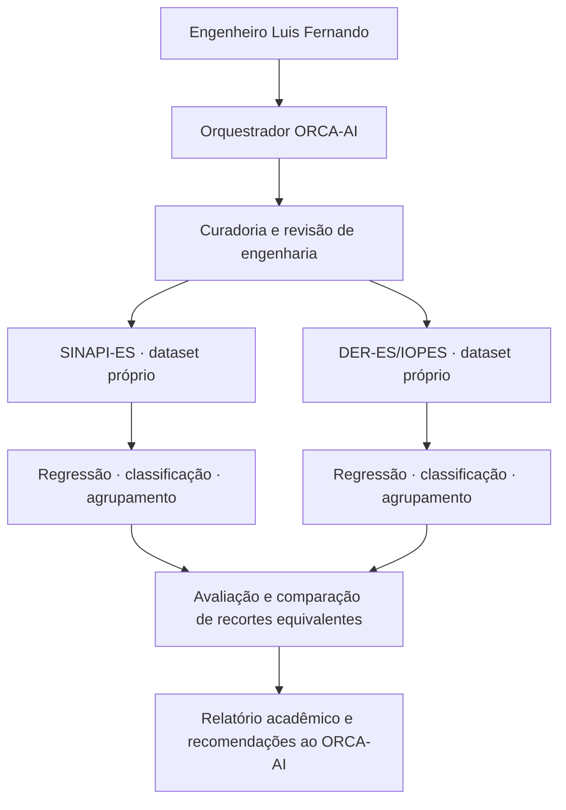

# Proposta de projeto — Machine Learning aplicado ao ORCA-AI

**Responsável:** engenheiro Luis Fernando.  
**Disciplina:** aprendizado de máquina aplicado a dados estruturados — UFG.  
**Data:** 27/09/2026. **Estado:** proposta para orientar a implementação em Python no VS Code.

**Atualização da execução em 27/09/2026:** após a regressão, o usuário autorizou classificação, agrupamento e consolidação, confirmando pintura e acabamentos. O [módulo implementado](../../ml/README.md) registra os três experimentos. O [plano da consolidação](plano_consolidacao_acabamentos.md) fixa o recorte efetivo e os critérios de avaliação. Na regressão, a estabilidade técnica é verificada nas entradas t-2..t; mudanças observadas no alvo t+1 são identificadas após a previsão, para não selecionar antecipadamente uma amostra que só se provou estável no futuro.

Os capítulos abaixo preservam a concepção inicial. Na execução atual, as classes são **derivadas dos grupos oficiais**, sem revisão humana presumida; as escalas de agrupamento são ajustadas por fonte, com comparação descritiva de perfis. O estudo não executa transferência entre bases nem um benchmark de equivalências técnicas. O snapshot comum é maio/2026, e o histórico da regressão chega até esse mês.

## 1. Projeto proposto

**Título:** Análise de composições e previsão de custos referenciais de obras no Espírito Santo com aprendizado de máquina.

O projeto acrescentará ao ORCA-AI três funções: estimar a evolução de custos referenciais, sugerir a família técnica de uma composição e encontrar composições com perfis semelhantes de recursos. A primeira aplicação será no **SINAPI-ES**. Depois, o mesmo protocolo será aplicado ao **DER-ES/IOPES**, com dados e modelos separados. A comparação será feita após validar a correspondência entre os recortes.

O engenheiro Luis Fernando confirmou o escopo de **regressão, classificação e agrupamento**. Regressão e classificação são tarefas de aprendizado supervisionado; agrupamento é não supervisionado. **Aprendizado por reforço fica para uma evolução futura**, fora das entregas deste trabalho.

### Modelos selecionados a partir das aulas

| Tarefa | Modelo principal proposto | Pergunta que o experimento responderá | Resultado para o ORCA-AI |
| --- | --- | --- | --- |
| Regressão | **Regressão Linear simples e múltipla** — `LinearRegression` | O histórico recente melhora a previsão do próximo custo publicado? | Cenário de custo por serviço e competência, com erro medido |
| Classificação | **Random Forest** — `RandomForestClassifier` | Os recursos de uma composição permitem sugerir sua família técnica? | Família sugerida e divergências para conferência |
| Agrupamento | **K-Means** — `KMeans` | Quais composições têm perfis semelhantes de uso de recursos? | Grupos e seus perfis de mão de obra, materiais e equipamentos |

Árvore de decisão e KNN serão comparadores da classificação. A regressão polinomial poderá entrar como comparação didática de grau baixo, se houver histórico suficiente. A escolha do melhor candidato será feita na validação, sem antecipar qual terá melhor desempenho.

Esses algoritmos aparecem nos materiais da disciplina e nos scripts fornecidos. O [mapa das aulas e dos exemplos Python](mapa_materiais_disciplina.md) registra as páginas e os arquivos. A implementação usa modelos clássicos de ML; o orquestrador do ORCA-AI pode explicar e encaminhar os resultados usando sua estrutura existente.

## 2. Dados disponíveis e preparação necessária

| Fonte | Evidência disponível nesta etapa | O que falta preparar |
| --- | --- | --- |
| SINAPI, agosto/2026 | ZIP oficial baixado; quatro planilhas lidas em memória; custos por UF e relações analíticas serviço–recurso identificados | Extrair o recorte ES, validar códigos, resolver subcomposições e produzir as tabelas de ML |
| DER-ES/IOPES, maio/2026 | Auditoria anterior abriu amostras de serviços, insumos e composições do pacote oficial | Preservar o pacote no repositório de dados e validar a extração integral |
| Histórico das duas fontes | Portais com edições anteriores identificados | Baixar, conferir continuidade, publicações, retificações e estabilidade dos serviços |
| Doze projetos existentes | Acervo de orçamento preservado no ORCA-AI | Selecionar, posteriormente, exemplos adequados para demonstração e revisão técnica |

O ZIP SINAPI é nacional: o estudo selecionará os campos do **Espírito Santo**. A aba `Analítico` contém códigos, tipos de recurso, unidades e coeficientes. A planilha de famílias contém famílias de **insumos**; sua função é diferente da composição analítica. Os detalhes e as referências às células estão na [nota de evidências do SINAPI](evidencias_dados_sinapi_es.md).

### Configuração inicial proposta

- Começar pelo recorte de edificações, com **regime sem desoneração**, identificado explicitamente nos arquivos; confirmar a correspondência de regime no DER antes da comparação.
- Separar custo direto, encargos e eventual BDI conforme a documentação da edição. Comparar a mesma grandeza nas duas fontes.
- Usar a edição mais recente verificada para a demonstração atual. Guardar versões fixas para os experimentos acadêmicos, sem trocar os dados durante a avaliação.
- Investigar inicialmente o histórico de 2025–2026. A janela final depende das edições efetivamente recuperadas e da continuidade técnica dos serviços.
- Escolher um conjunto de famílias com cobertura suficiente nas duas bases. Pintura, alvenaria, revestimentos, impermeabilização e instalações são candidatos a verificar; ainda não são classes homologadas.

### Tabelas derivadas

| Tabela | Campos principais |
| --- | --- |
| `edicoes` | Base, UF, competência, regime, revisão, publicação, captura, URL e SHA-256 |
| `servicos` | Edição, código original, descrição, unidade, grupo nativo, custo, situação e indicadores de ausência/origem do preço |
| `insumos` | Edição, código, categoria, descrição, unidade e preço da UF |
| `composicoes` | Serviço, tipo do item, código do item, coeficiente, unidade e vínculo com subcomposição |
| `rotulos_revisados` | Serviço, família técnica, revisor, justificativa e versão da taxonomia |
| `atributos` | Variáveis de cada tarefa, chave de rastreabilidade, grupo de equivalência e partição experimental |

As chaves incluirão base e edição: um código isolado não identifica unicamente um registro. Descrições oficiais serão preservadas para conferência. No primeiro experimento, as entradas dos modelos serão colunas numéricas e categóricas; a classificação por texto poderá ser estudada depois.

### Conferências antes do treinamento

1. Validar códigos, unidades, custos e coeficientes contra amostras das planilhas, incluindo casos com fórmulas, valores ausentes e composições auxiliares.
2. Tratar os códigos em fórmulas `HYPERLINK`: na amostra SINAPI, a leitura apenas do valor armazenado retornou `0` para um código válido. Não usar esse zero como identificador.
3. Distinguir ausência de recurso, recurso sem preço e falha de extração. Um hífen de custo não vira zero.
4. Expandir subcomposições com detecção de ciclos, multiplicação dos coeficientes e prevenção de dupla contagem. Não somar coeficientes de unidades incompatíveis.
5. Registrar o indicador `%AS` do SINAPI, relativo ao uso de preços de São Paulo quando faltam preços locais. Medir sua cobertura e avaliar separadamente os serviços afetados, conforme a documentação da edição.
6. Reconciliar os custos calculados com os custos publicados, considerando regras oficiais de arredondamento. Manter divergências registradas e fora dos exemplos homologados até serem explicadas.

A presença de linhas nas planilhas não equivale à quantidade de exemplos válidos. O relatório de qualidade informará serviços únicos, composições completas, classes, períodos e exclusões.

## 3. Experimento de regressão

### Problema e modelo

**Objetivo:** prever o custo unitário referencial da competência seguinte para serviços com histórico tecnicamente comparável.

- **Unidade de observação:** serviço × competência, dentro de uma família e unidade compatíveis.
- **Entrada simples:** último custo publicado disponível na data de corte.
- **Entradas múltiplas:** custos das competências anteriores, por exemplo `custo_t`, `custo_t_1` e `custo_t_2`, quando consecutivos e disponíveis. Outras variáveis só entram com justificativa e disponibilidade comprovada antes da previsão.
- **Alvo:** custo publicado de `t+1`, com unidade, regime e escopo preservados.
- **Modelo:** `LinearRegression`, primeiro simples e depois múltipla.
- **Referência de comparação:** repetir o último custo conhecido, chamada previsão de persistência.

Os modelos serão ajustados por recortes de família e unidade que tenham dados suficientes. “Próxima competência” significa o período seguinte ao último dado conhecido: maio → junho, por exemplo. O atraso de publicação será registrado para não confundir esse horizonte com o próximo mês do calendário atual.

### Avaliação

Os cortes serão cronológicos, por competência, mantendo todos os serviços de um mês no mesmo bloco. Como desenho inicial, reservar as três últimas competências aproveitáveis para teste e usar janelas anteriores de validação, se o histórico permitir. Fixar os cortes antes de escolher os parâmetros. Não dividir aleatoriamente as linhas do painel temporal.

A avaliação será sucessiva, com horizonte de uma competência: os parâmetros do modelo ficam congelados no início do teste, e as entradas de cada previsão podem incorporar custos de meses anteriores do próprio teste somente depois de sua publicação. Registrar a data de origem de cada previsão. Esse desenho mede previsões de um passo repetidas, e não três meses previstos de uma única data inicial.

Uma retificação publicada depois da data de corte não poderá entrar como se já fosse conhecida. Quando não for possível reconstruir as versões disponíveis em cada data, declarar que o estudo usa a história revisada e restringir sua interpretação.

**Métricas:** MSE, presente nas aulas; MAE e RMSE como complementos de interpretação. Apresentar erros por família, unidade e competência, além do ganho ou perda frente à persistência. R² será complementar, pois pode ser alto sem superar uma referência simples.

**Saída:** arquivo de previsões com custo observado, estimado, erro, competência, data de corte e versão do modelo; gráficos de evolução e resíduos. O ORCA-AI poderá apresentar cenários de planejamento apoiados nesses resultados.

### Alternativa caso o histórico seja insuficiente

Usar regressão de **custo contemporâneo**, em uma família homogênea, com atributos técnicos revisados — dimensões, material, acabamento e processo — disponíveis antes da estimativa. Comparar `LinearRegression` com a mediana do treino, separando variantes equivalentes por grupos.

Essa alternativa exige preparação de atributos que ainda não existe. Não usar os custos parciais atuais cuja soma determina o alvo, nem prever um total a partir da multiplicação já conhecida de quantidade por preço. A troca de problema será registrada antes do treinamento, com resultados descritos como estimativa contemporânea.

## 4. Experimento de classificação

### Problema e modelos

**Objetivo:** sugerir a família técnica de uma composição própria ou importada **cuja estrutura de recursos já esteja disponível**.

- **Entrada:** unidade do serviço; contagens de recursos distintos por categoria; presença de famílias de materiais e ocupações; horas de mão de obra/equipamentos por unidade quando comparáveis.
- **Alvo:** família técnica revisada a partir dos grupos oficiais e do conhecimento de engenharia.
- **Principal candidato:** `RandomForestClassifier`.
- **Comparadores das aulas:** `DecisionTreeClassifier` e `KNeighborsClassifier`.
- **Referência simples:** prever a classe mais frequente do treino.

A taxonomia de famílias será definida antes do treinamento. Código e prefixo do serviço, grupo nativo, posição no relatório e quaisquer campos que revelem diretamente o rótulo ficarão fora das entradas. As categorias dos insumos terão definição independente da família que o modelo deve prever.

Uma solicitação inicial em texto, sem composição, não fornece esses atributos. A utilidade deste experimento é organizar e conferir composições disponíveis; a escolha de composição a partir de texto pertence a outra aplicação.

### Avaliação

Manter composições iguais, variantes próximas e versões mensais no mesmo grupo de partição. Reservar aproximadamente 15% dos grupos para teste, quando a distribuição das classes permitir. Nos demais dados, usar três ou cinco partições de validação, conforme a quantidade de grupos independentes por classe.

Imputação, codificação e escalonamento serão ajustados dentro de cada treino. KNN usará escalonamento numérico. Escolher modelos e parâmetros por **F1 macro** na validação; apresentar também precisão e recall por classe, matriz de confusão, acurácia balanceada e número de exemplos.

**Saída:** família sugerida, comparação com o rótulo revisado e casos de erro para análise. Uma pontuação interna do classificador não será apresentada como probabilidade calibrada sem avaliação específica. O especialista poderá corrigir sugestões e registrar a justificativa para versões futuras do dataset.

## 5. Experimento de agrupamento

### Problema e modelo

**Objetivo:** encontrar perfis semelhantes de composição, sem fornecer as famílias técnicas ao treinamento.

- **Entrada preferencial:** participações de mão de obra, materiais, equipamentos e outros no custo direto; contagem e diversidade de recursos.
- **Condições:** categorias revisadas, custos e subcomposições conciliados, denominador positivo e tratamento explícito dos preços ausentes.
- **Modelo:** `KMeans`, com padronização das variáveis, várias inicializações e sementes registradas.
- **Escolha de `k`:** explorar uma faixa pequena compatível com a amostra, inicialmente de 2 a 8 quando possível, e avaliar qualidade e tamanho dos grupos. Não fixar o número de grupos para reproduzir as classes da classificação.

Se as participações completas ainda não puderem ser calculadas, testar um recorte estrutural de contagens e presenças de recursos, declarando que ele responde a uma pergunta mais restrita. Preços absolutos de serviços com unidades diferentes não serão misturados como medida de similaridade.

### Avaliação e interpretação

Usar curva de inércia, silhouette, Davies–Bouldin e Calinski–Harabasz, apresentados nas aulas. Examinar estabilidade entre sementes e reamostragens, tamanhos dos grupos e exemplos representativos. O engenheiro Luis Fernando revisará se os perfis fazem sentido na prática.

PCA poderá ser usado para uma visualização em duas dimensões, com variância explicada informada. A proximidade no gráfico não substitui a avaliação no espaço usado pelo modelo. LDA, também presente no material, é supervisionado e não será tratado como algoritmo de agrupamento.

**Saída:** serviço → grupo, tabela de perfis e gráficos. Nomes como “maior participação de mão de obra” serão atribuídos após observar os resultados. Um grupo não equivale automaticamente a uma classe oficial ou a serviços tecnicamente substituíveis.

## 6. Como comparar SINAPI-ES e DER-ES/IOPES

### Duas execuções independentes

Cada base terá extração, dataset, treino, validação, teste, modelos e resultados próprios. IOPES é a referência histórica associada ao DER-ES neste projeto; o mesmo catálogo não será contado duas vezes.

### Dois níveis de comparação

1. **Resultados em cada catálogo:** cobertura, distribuição das classes, qualidade da extração e desempenho em seu próprio recorte. Descrevem o comportamento local e não formam um ranking direto.
2. **Recorte comparável:** mesmas famílias revisadas, atributos, regime, UF, unidades, competências e protocolo. Equivalências entre serviços serão verificadas tecnicamente. Ambos terão o mesmo limite de ajustes de modelos.

Agosto/2026 no SINAPI e maio/2026 no DER representam competências distintas. **Maio/2026 é um candidato a edição comum**, condicionado à obtenção e conferência do pacote SINAPI desse mês. Na regressão, comparar a janela histórica comum que sobreviver à auditoria.

| Tarefa | Comparação que será apresentada |
| --- | --- |
| Regressão | Erros por família/unidade e melhoria frente à persistência em cada fonte, no mesmo horizonte |
| Classificação | F1 macro e erros por classe harmonizada, com cobertura e quantidade de grupos independentes |
| Agrupamento | Perfis dos grupos, estabilidade e métricas sob a mesma definição de atributos e distância |

Na comparação de agrupamentos, ajustar a escala comum usando apenas o conjunto destinado à construção do benchmark, com a mesma regra de peso das fontes. Ajustar os K-Means separadamente. Uma análise secundária poderá aplicar cada modelo aos mesmos serviços equivalentes reservados para avaliação. Identificadores de cluster são arbitrários: “grupo 1” de uma base não corresponde automaticamente ao “grupo 1” da outra.

Se o objetivo for medir generalização para serviços novos, equivalentes das duas bases terão o mesmo destino na divisão de treino/teste. Não usar um serviço copiado de uma base para favorecer a avaliação na outra. Transferência SINAPI → DER ou DER → SINAPI ficará como extensão posterior.

Não combinar MSE, F1 e silhouette em uma nota única. Diferenças de desempenho não demonstram, por si, que uma tabela oficial é superior à outra.

## 7. Desenvolvimento em Python e VS Code

Bibliotecas propostas: **pandas, NumPy, scikit-learn, openpyxl e Matplotlib**; Jupyter para os notebooks de demonstração. O ambiente virtual e as versões serão fixados quando a implementação for validada. Execução inicial local em CPU; medir tempo e memória antes de ampliar os dados.

### Organização prevista

```text
OrcaAI/
├── bases/
│   ├── sinapi/<competencia>/originais/  # ZIPs e manifestos preservados
│   └── der_es/<competencia>/originais/  # A criar na coleta
├── knowledge/datasets/ml_ufg/          # Dados derivados versionados
│   ├── sinapi_es/
│   ├── der_es/
│   └── comparacao/                     # Taxonomia e equivalências revisadas
└── ml/                                # Implementação futura
    ├── README.md                      # Preparação e execução no VS Code
    ├── requirements.txt               # Versões verificadas
    ├── configs/                       # Base, regime, período e experimentos
    ├── src/orca_ml/
    │   ├── ingestao/                  # Leitores específicos de cada fonte
    │   ├── qualidade.py               # Integridade e reconciliação
    │   ├── atributos.py               # X e y próprios de cada tarefa
    │   ├── particoes.py               # Grupos e cortes cronológicos
    │   ├── regressao.py
    │   ├── classificacao.py
    │   ├── agrupamento.py
    │   └── comparacao.py
    ├── notebooks/                     # Exploração e apresentação das 3 tarefas
    ├── tests/                         # Casos críticos de extração e partições
    ├── models/<base>/<execucao>/
    └── outputs/<base>/<execucao>/      # Métricas, previsões e figuras
```

Os diretórios de implementação acima são planejados. Esta etapa entrega a proposta e suas evidências. `Projetos/` permanece como estrutura inicial já criada; os datasets ativos terão uma única localização canônica no núcleo `OrcaAI/`.

Cada execução deverá registrar configuração, versões das bibliotecas, sementes, hashes dos dados, partições, modelo, previsões e métricas. A demonstração no VS Code usará os mesmos módulos dos experimentos, para evitar cálculos diferentes nos notebooks.

## 8. Etapas e critérios de conclusão

| Etapa | Entrega | Critério para avançar |
| --- | --- | --- |
| 1. Preparar SINAPI-ES | Leitor, tabelas derivadas, dicionário e relatório de qualidade | Amostras conferidas, códigos corretos, ausências registradas e custos conciliados |
| 2. Definir o benchmark | Famílias revisadas, atributos e partições; auditoria histórica iniciada | Classes e recortes com exemplos independentes suficientes; teste reservado |
| 3. Executar classificação e agrupamento | Referência simples, candidatos, grupos, métricas e análise de erros | Execuções reproduzíveis e interpretação técnica dos resultados |
| 4. Executar regressão | Histórico validado, persistência e modelos lineares | Cortes temporais verificáveis; ou adoção documentada da alternativa contemporânea |
| 5. Replicar no DER-ES | Dataset e três experimentos separados | Mesmo significado das variáveis e protocolo documentado |
| 6. Comparar as bases | Benchmark comum e relatório comparativo | Período, regime, unidades e equivalências conferidos; limites expostos |
| 7. Entregar à disciplina | Código Python, notebooks, figuras, relatório e demonstração | Uma execução documentada reproduz os resultados apresentados |

A coleta histórica pode ocorrer em paralelo às etapas 2 e 3. A quantidade de serviços, as classes finais e o calendário de execução serão definidos após o relatório de qualidade; não foram estimados a partir do número bruto de linhas.

## 9. Equipe e incorporação ao ORCA-AI

O orquestrador A1 mantém a coordenação. A11/PesquisadorMLUFG organiza os experimentos; SA-ML-01 prepara dados; SA-ML-03 treina; A9/SA-ML-05 conferem avaliação e rastreabilidade. A5 valida fontes e edições; A2/A6/A7 e o engenheiro Luis Fernando revisam unidades, composições, rótulos e equivalências. O Agente 5S cuida da organização e preservação do acervo.



Essas responsabilidades aproveitam a [estrutura agêntica proposta](agentes_e_subagentes.md). Nesta consulta, os subagentes de regressão, classificação e pesquisa das bases confrontaram as aulas com o esquema dos dados. As fichas permanentes de agentes continuam como especificações; o pipeline será construído nas etapas acima.

Os resultados entrarão primeiro como arquivos e relatórios que o ORCA-AI pode consultar. API Knowledge, embeddings, Qdrant, aprendizado por reforço e automação de decisões no Orçafascio ficam para evoluções posteriores. Os doze projetos originais permanecem preservados; exemplos selecionados poderão apoiar a demonstração, sem transformar automaticamente as doze pastas em amostras de treinamento.

## 10. Resultados esperados e limites do estudo

O trabalho entregará três experimentos para cada base, uma comparação com referências simples nas tarefas supervisionadas, uma interpretação dos agrupamentos e um estudo comparativo entre fontes. Espera-se medir **se há ganho útil**, onde ocorrem os erros e quais limitações vêm dos dados.

Um modelo que não supera a persistência, um classificador que confunde famílias ou agrupamentos instáveis são resultados acadêmicos válidos quando medidos e explicados. Não há promessa de acurácia antes dos experimentos. O alvo da regressão é custo **referencial publicado**; custo real de execução e preço vencedor de licitação exigiriam outros dados.

### Referências de implementação

- [Documentação oficial de LinearRegression](https://scikit-learn.org/stable/modules/generated/sklearn.linear_model.LinearRegression.html).
- [Documentação oficial de RandomForestClassifier](https://scikit-learn.org/stable/modules/generated/sklearn.ensemble.RandomForestClassifier.html).
- [Documentação oficial de KMeans](https://scikit-learn.org/stable/modules/generated/sklearn.cluster.KMeans.html).
- [Separação temporal com TimeSeriesSplit](https://scikit-learn.org/stable/modules/generated/sklearn.model_selection.TimeSeriesSplit.html), adaptada aqui para blocos de competências.
- [Materiais da disciplina e relação com cada decisão](mapa_materiais_disciplina.md).
- [Evidências do ZIP SINAPI](evidencias_dados_sinapi_es.md) e [auditoria anterior das bases](../../docs/auditoria_bases_referenciais_2026-09-27.md).
