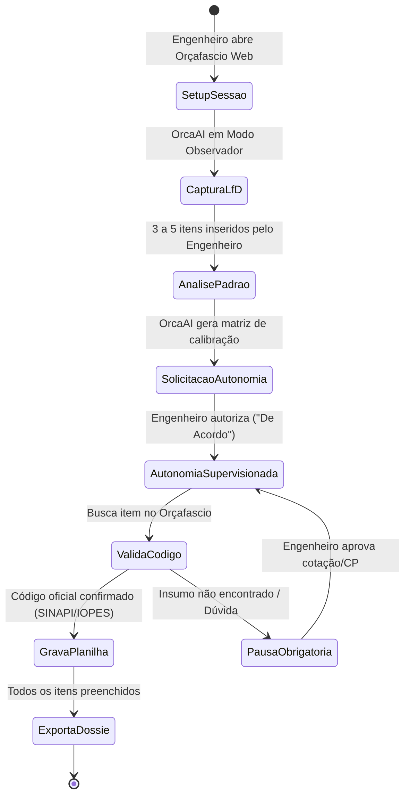

# Procedimento Operacional Padrão (POP)
## Pipeline de Aprendizado e Navegação Autônoma no Orçafascio (LfD)

---

## 1. Objetivo
Padronizar a rotina de trabalho em que o engenheiro orçamentista opera a interface do **Orçafascio Web** para treinar o OrcaAI, permitindo que a IA assuma a busca e preenchimento autônomo com taxa zero de erros e alucinações.

---

## 2. Passo a Passo da Operação

### Etapa 1: Setup e Autenticação
1. O engenheiro inicia a sessão acessando `https://app.orcafascio.com/` com as credenciais `mgi.sra-es.serl@gestao.gov.br`.
2. Cria ou abre o orçamento do projeto (ex: `MNT_EDIFICIO_MGI_ES_2026`).
3. O OrcaAI ativa o **Agente 3 (`OrcafascioPilot`)** em modo `LISTEN_AND_RECORD`.

### Etapa 2: Gravação e Calibração
1. O engenheiro adiciona os primeiros 3 a 5 itens da EAP no Orçafascio.
2. O OrcaAI extrai os padrões:
   - Termos de busca utilizados.
   - Famílias de composições preferenciais.
   - Aplicação da alíquota de BDI (25%).

### Etapa 3: Transição para Autonomia
1. O OrcaAI apresenta a mensagem de prontidão:
   > *"Padrão de modelagem assimilado com sucesso para a obra [NOME_OBRA]. Deseja que eu assuma a inserção dos próximos itens da EAP de forma autônoma?"*
2. Com a confirmação do engenheiro, o **Agente 3 (`OrcafascioPilot`)** assume o controle do browser.

### Etapa 4: Navegação Autônoma e Trava Anti-Alucinação
1. O OrcaAI pesquisa diretamente as composições no banco de dados do Orçafascio.
2. Antes de clicar em "Adicionar Item", o **Agente 9 (`AuditorConformidade`)** valida se o código corresponde exatamente às tabelas oficiais.
3. Se um serviço não existir no SINAPI/IOPES, a automação para e aciona o **Agente 4 (`PesquisadorMercado`)**.
