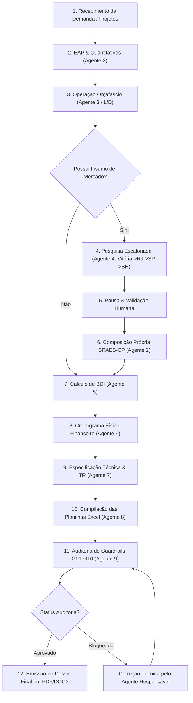

# Procedimento Operacional Padrão (POP)
## Pipeline de Geração do Dossiê Completo de Contratação Pública

---

## 1. Fluxo Integrado de Ponta a Ponta

---

## 2. Relação das Peças Finais Geradas

1. `01_Planilha_Orcamentaria_Analitica.xlsx`
2. `02_Composicoes_Custos_Unitarios_Proprias.xlsx`
3. `03_Demonstrativo_e_Justificativa_BDI.pdf`
4. `04_Cronograma_Fisico_Financeiro.xlsx`
5. `05_Especificacao_Tecnica_e_Memorial_Descritivo.docx` / `.pdf`
6. `06_Mapa_Cotacoes_Pesquisa_Mercado.pdf`
7. `07_Relatorio_Conformidade_e_Auditoria_G01_G10.pdf`
